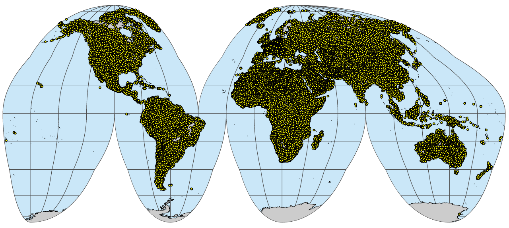
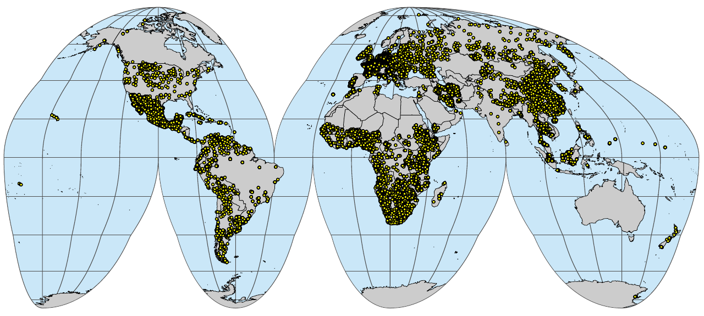

# WRB soil types

```{r, results = "asis", echo = FALSE}
status("drafting")
```

```{r, include=FALSE, message=FALSE, results='hide'}
ls <- c("rgdal", "raster", "terra", "sf", "ggplot2", "tidyverse", "Hmisc")
new.packages <- ls[!(ls %in% installed.packages()[,"Package"])]
if(length(new.packages)) install.packages(new.packages)
lapply(ls, require, character.only = TRUE)
```

```{r librs, include=FALSE}
library(plyr)
library(rgdal)
library(dplyr)
library(tidyverse)
library(rgeos)
library(fastSave)
library(cowplot)   # for theme_minimal_grid()
library(sf)        # for manipulation of simple features objects
library(rworldmap) # for getMap()
library(ggplot2)
library(terra)
library(captioner)
library(olctools)
fig_nums <- captioner(prefix = "Fig.")
#load.pigz("soilwrb.RData")
source('./R/data_functions.R')
```

## Overview

This section describes import steps used to produce a global compilation of 
FAO's IUSS's [World Reference Base (WRB)](https://www.fao.org/soils-portal/data-hub/soil-classification/world-reference-base/en/) observations of soil types. 
Classes are either used as-is or a translated from some local or international system. 
[Correlation tables](https://github.com/OpenGeoHub/SoilSamples/tree/main/correlation) are available in the folder `./correlation` and is based on 
various literature sources. Correlation is not trivial and often not 1:1 so we 
typically use 2–3 options for translating soil types [@krasilnikov2009handbook]. Output compilations are 
available in the [folder](https://github.com/OpenGeoHub/SoilSamples/tree/main/out) `./out`. 
Please refer to the dataset version / DOI to ensure full reproducibility of your modeling.

This dataset is currently used to produce [soil type maps of the world](https://github.com/OpenGeoHub/SoilTypeMapping/) 
at various spatial resolutions. To add new dataset please open a [new issue](https://github.com/OpenGeoHub/SoilSamples/issues) or do a merge request. 

## WoSIS point datasets

There are currently several global datasets that reference distribution of WRB 
classes. For building training points for predictive soil type mapping the most 
comprehensive dataset seems to be World Soil Information Service (WoSIS) soil profile database (available via: 
https://www.isric.org/explore/wosis) [@batjes2020standardised].

You can download the most up-to-date snapshot of the most up-to-date WOSIS Geopackage file directly 
by using the [ISRIC's Web Feature Service](https://www.isric.org/explore/wosis/accessing-wosis-derived-datasets#Access_data). 
Below is an example of a snapshot downloaded on 10-April-2023:

```{r, eval=FALSE}
wosis = sf::read_sf("/mnt/landmark/HWSDv2/wosis_latest_profiles.gpkg")
summary(as.factor(wosis$cwrb_version))
```

The WRB soil types can be generate by combining multiple columns:

```{r, eval=FALSE}
wosis$wrb4 = paste0(ifelse(is.na(wosis$cwrb_prefix_qualifier), "", paste0(wosis$cwrb_prefix_qualifier, " ")), wosis$cwrb_reference_soil_group, ifelse(is.na(wosis$cwrb_suffix_qualifier), "", paste0(" ", wosis$cwrb_suffix_qualifier)))
summary(as.factor(wosis$wrb4), maxsum=20)
```

This finally gives about 30,000 soil points with soil classification:

```{r, eval=FALSE}
wosis.wrb = wosis[!wosis$wrb4=="NA", c("profile_id", "geom_accuracy", "latitude", "longitude", "wrb4", "dataset_id")]
str(wosis.wrb)
#plot(wosis.wrb[,c("longitude","latitude")])
```

We can write the [summary distribution](https://github.com/OpenGeoHub/SoilSamples/blob/main/correlation/wosis.wrb_summary.csv) of soil types by using:

```{r, eval=FALSE}
xs0 = summary(as.factor(wosis.wrb$wrb4), maxsum = length(levels(as.factor(wosis.wrb$wrb4))))
write.csv(data.frame(WRB=attr(xs0, "names"), count=xs0), "./correlation/wosis.wrb_summary.csv")
```

After some clean-up, we can prepare a harmonized legend that now has consistently 
WRB soil types up to the level of great-group + prefix and with soil points 
that have a location accuracy of not worse than 1 km:

```{r, eval=FALSE}
h.wosis = read.csv("./correlation/WOSIS_WRB_legend.csv")
h.wosis$wrb4 = h.wosis$WRB
wosis.wrb$h_wrb4 = plyr::join(as.data.frame(wosis.wrb["wrb4"]), h.wosis)$h_wrb4
## copy values
wosis.wrb2 = wosis.wrb
wosis.wrb2$h_wrb4 = plyr::join(as.data.frame(wosis.wrb2["wrb4"]), h.wosis)$h_wrb4.2
#summary(as.factor(wosis.wrb$h_wrb4))
#str(levels(as.factor(wosis.wrb$h_wrb4)))
## remove points with poor location accuracy
h.wosis.wrb = rbind(
     as.data.frame(wosis.wrb[!(is.na(wosis.wrb$h_wrb4)|wosis.wrb$h_wrb4==""|wosis.wrb$geom_accuracy>0.08334),]), 
     as.data.frame(wosis.wrb2[!(is.na(wosis.wrb2$h_wrb4)|wosis.wrb2$h_wrb4==""|wosis.wrb2$geom_accuracy>0.08334),]))
h.wosis.wrb$source_db = h.wosis.wrb$dataset_id
dim(h.wosis.wrb)
saveRDS.gz(h.wosis.wrb, "./correlation/h.wosis.wrb.rds")
```

which can be now considered an analysis-ready point dataset with `h_wrb4` being the 
harmonized value of the soil type:

```{r}
h.wosis.wrb = readRDS("./correlation/h.wosis.wrb.rds")
head(h.wosis.wrb)
```


## HWSDv2

A disadvantage of using only legacy soil profiles, however, is that these are often 
spatially clustered i.e. large gaps exists where almost no data available. This applies especially 
for African and Asian continents. To increase spatial coverage of the training points for 
[global soil type mapping](https://github.com/OpenGeoHub/SoilTypeMapping), we can add points generated from the global soil polygon map 
e.g. [Harmonized World Soil Database](https://iiasa.ac.at/models-tools-data/hwsd) (HWSD) [@hwsd2023]. 
This can be done in three steps: first, we prepare [summary of all WRB soil types](https://github.com/OpenGeoHub/SoilSamples/blob/main/correlation/hwsd2_summary.csv) in the HWSDv2:

```{r, eval=FALSE}
hwsd <- mdb.get("/mnt/landmark/HWSDv2/HWSD2.mdb")
#str(hwsd)
wrb.leg = hwsd$D_WRB4
#str(wrb.leg)
wrb.leg$WRB4 = wrb.leg$CODE
layer = hwsd$HWSD2_LAYERS[,c("HWSD2.SMU.ID", "WRB4")]
layer$VALUE = plyr::join(layer, wrb.leg[c("VALUE","WRB4")], match="first")$VALUE
xs = summary(as.factor(layer$VALUE), maxsum = nrow(wrb.leg))
write.csv(data.frame(WRB4=attr(xs, "names"), count=xs), "./correlation/hwsd2_summary.csv")
```

The `./correlation/hwsd2_summary.csv` table now shows which are the most frequent soil types 
for the world based on the HWSDv2. Note, these are primarily expert-based and of 
unknown uncertainty / confidence, so should be used with caution, unlike WoSIS and 
other legacy soil profiles which are based on actual soil observations and fieldwork.

Second, we can prepare a raster layer that we can use to randomly draw training points 
using some probability sampling e.g. [Simple Random Sampling](https://opengeohub.github.io/spatial-sampling-ml/). 
Because we want to draw samples from an equal area space, a good idea is to convert the 
original HWSD raster to the [IGH projection](https://epsg.io/54052):

```{r, eval=FALSE}
rgdal::GDALinfo("/mnt/landmark/HWSDv2/HWSD2.bil")
## 1km resolution
te = c(-20037508,-6728980, 20037508, 8421750)
gh.prj = "+proj=igh +ellps=WGS84 +units=m +no_defs"
system(paste0('gdalwarp /mnt/landmark/HWSDv2/HWSD2.bil /mnt/landmark/HWSDv2/HWSD2_gh_1km.tif -r \"near\" 
      --config CHECK_WITH_INVERT_PROJ TRUE -t_srs \"', gh.prj, 
      '\" -co \"COMPRESS=DEFLATE\" -tr 1000 1000 -overwrite -te ', 
      paste(te, collapse = " ")))
```

Now we can sample random points from the projected raster by using the terra package functionality [@hijmans2019spatial]. 
We generate 100,000 random points, although in principle we can later on subset the points to much less 
points as needed.

```{r, eval=FALSE}
rnd.hwsd = terra::spatSample(terra::rast("/mnt/landmark/HWSDv2/HWSD2_gh_1km.tif"), 
                             size=1e5, method="random", na.rm=TRUE, xy=TRUE)
## merge and make WRB4 layer
names(rnd.hwsd)[3] = "HWSD2.SMU.ID"
rnd.hwsd$WRB4 = plyr::join(rnd.hwsd, layer[c("HWSD2.SMU.ID","VALUE")], match="first")$VALUE
rnd.sf = sf::st_as_sf(rnd.hwsd, coords = c(1,2), crs=gh.prj)
rnd.ll <- rnd.sf %>% sf::st_transform(4326)
unlink("./correlation/sim_hwsdv2_pnts.gpkg")
sf::write_sf(rnd.ll, "./correlation/sim_hwsdv2_pnts.gpkg", driver = "GPKG")
saveRDS(rnd.ll, "./correlation/sim_hwsdv2_pnts.rds")
```

We can further harmonize values using a correlation legend:

```{r}
rnd.ll = readRDS("./correlation/sim_hwsdv2_pnts.rds")
h.hwsd = read.csv("./correlation/HWSDv2_WRB_legend.csv")
hwsd.wrb = as.data.frame(cbind(rnd.ll, sf::st_coordinates(rnd.ll)))
hwsd.wrb = plyr::rename(hwsd.wrb, c("X"="longitude", "Y"="latitude"))
hwsd.wrb$h_wrb4 = plyr::join(hwsd.wrb, h.hwsd)$h_wrb4
hwsd.wrb$source_db = "HWSDv2"
hwsd.wrb$profile_id = paste0("SIM", 1:nrow(hwsd.wrb))
## subset to complete points
hwsd.wrb = hwsd.wrb[!is.na(hwsd.wrb$WRB4),]
```

which now also has a harmonized column `h_wrb4` compatible to the column produced 
using the WoSIS points:

```{r}
head(hwsd.wrb)
```

So in summary we have prepared two point datasets from WoSIS and HSWDv2. 
WoSIS are the actual observations of soil types and should be considered ground-truth. 
The HWSDv2 contains the WRB 2022 version soil types per mapping unit, but these are 
potentially of variable accuracy and should be only used to fill gaps in training data. 
We had to manually adjust harmonize some classes that we either outdated (old WRB versions) 
or are missing prefix / suffix.

There are many more point datasets with WRB classification or compatible classification 
that could be added to the list of training points. Below we list most recent 
datasets with soil types that we import and add to WoSIS to produce the most up-to-date 
compilation of soil training data.

## Additional point datasets with WRB classes

In addition to WoSIS and HWSDv2, we can also add some additional point datasets 
that are not yet included in any global compilation but potentially contain _ground-truth_ 
observations of soil types.
For example, we can use point observations coming from the land-surface observations e.g. 
to represent shifting sand and bare-rock areas. For example, global land cover validation data 
sets that are produced by photo-interpretation of very high resolution satellite imagery 
(e.g. 20 cm spatial resolution) often contain useful observations of the shifting sand, 
permanent ice and bare-rocks [@tsendbazar2021towards]. These specific surface materials 
are often missing or are systematically under-represented in the legacy soil profile datasets. 
Here is an example of almost 6000 observations of bare rock and shifting sands:

```{r}
lc.xy = readRDS("./correlation/photointerpretation_leptosol.rds")
summary(as.factor(lc.xy$h_wrb4))
```

Note that we define the `Shifting sands` as an additional category of soil type as these 
are arbitrarily either masked out or (controversially) classified to different soil types. 
We consider that it is more consistent to map shifting sands as a separate category of land.

Another dataset interesting for soil type mapping are the legacy soil observations 
focused on tropical peatlands, published in the literature, then digitized manually [@hengl2016global;@gumbricht2017expert]:

```{r, eval=FALSE}
peat.xy = read.csv("/mnt/diskstation/data/Soil_points/INT/CIFOR_peatlands/SOC_literature_CIFOR_v1.csv", na.strings = c("", "NA"))
peat.xy = plyr::rename(peat.xy, c("TAXNWRB"="h_wrb4", "modelling.x"="longitude", "modelling.y"="latitude", "SOURCEID"="profile_id"))
peat.xy$source_db = "CIFOR_peatlands"
peat.xy = peat.xy[!is.na(peat.xy$longitude) & !is.na(peat.xy$h_wrb4), c("profile_id", "source_db","longitude", "latitude", "h_wrb4")]
```

Peatlands and inaccessible tropical soil types are often under-represented and hence this 
dataset helps reduce the bias in under-representing tropical soils.

Croatian soil profile database also contains soil types still in FAO 
classification system [@antonic2003spatial]:

```{r, eval=FALSE}
hr.xy = readRDS("./correlation/hrspdb_pnts.rds")
hr.xy2 = hr.xy[,-which(names(hr.xy) == "h_wrb4")]
hr.xy2 = plyr::rename(hr.xy2, c("h_wrb4.2"="h_wrb4"))
```

Legacy soil observations for Italy [@righini2001banca;@vecchio2002regional]:

```{r, eval=FALSE}
it.xy = readRDS("/mnt/landmark/HWSDv2/taxa/WRB_points_Italy.rds")
it.xy = plyr::rename(it.xy, c("wrb2015"="h_wrb4", "id_site"="profile_id", "lat"="latitude", "long"="longitude"))
it.xy$source_db = "Italian_SPDB"
```

German agricultural soil inventory dataset [@poeplau2020stocks]:

```{r, eval=FALSE}
de.xy = readRDS("/mnt/landmark/HWSDv2/taxa/WRB_points_Germany.rds")
de.xy = plyr::rename(de.xy, c("WRB_correlation_1"="h_wrb4", "PointID"="profile_id", "lat"="latitude", "lon"="longitude"))
de.xy$Specific.soil.subtype = NULL
de.xy$source_db = "BZE_LW"
de.xy2 = de.xy[,-which(names(de.xy) == "h_wrb4")]
de.xy2 = plyr::rename(de.xy2, c("WRB_correlation_2"="h_wrb4"))
```

French RMQS soil profile and monitoring dataset [@AIQ9WS_2020]:

```{r, eval=FALSE}
fr.xy = readRDS("/mnt/landmark/HWSDv2/taxa/WRB_points_France.rds")
fr.xy = plyr::rename(fr.xy, c("WRB_correlation_1"="h_wrb4", "id_site"="profile_id", "lat"="latitude", "lon"="longitude"))
fr.xy$signific_ger_95 = NULL
fr.xy$source_db = "RMQS1"
fr.xy2 = fr.xy[,-which(names(fr.xy) == "h_wrb4")]
fr.xy2 = plyr::rename(fr.xy2, c("WRB_correlation_2"="h_wrb4"))
```

## Final compilation of analysis-ready points

Multiple imported point datasets can be finally combined into a single global 
consistent analysis-ready training dataset (here we limit to max 20,000 simulated points):

```{r, eval=FALSE}
sel.cn = c("profile_id","latitude", "longitude", "h_wrb4", "source_db")
tr.pnts = plyr::rbind.fill(list(h.wosis.wrb[, sel.cn], 
      hwsd.wrb[sample.int(2e4, n = nrow(hwsd.wrb)), sel.cn],
      lc.xy, hr.xy2[, sel.cn], 
      peat.xy[, sel.cn],
      hr.xy[, sel.cn],
      it.xy[, sel.cn], de.xy[, sel.cn], de.xy2[, sel.cn], 
      fr.xy[, sel.cn], fr.xy2[, sel.cn]))
```

We can clean-up some systematic naming issues common in many soil DBs:

```{r, eval=FALSE}
tr.pnts$h_wrb4 = gsub(",", " ", tr.pnts$h_wrb4)
tr.pnts$h_wrb4 = gsub("distric", "dystric", tr.pnts$h_wrb4, ignore.case = TRUE)
tr.pnts$h_wrb4 = gsub("sol ", "sols ", tr.pnts$h_wrb4, ignore.case = TRUE)
tr.pnts$h_wrb4 = gsub("sol$", "sols", tr.pnts$h_wrb4, ignore.case = TRUE)
tr.pnts$h_wrb4 = ifelse(tr.pnts$h_wrb4=="", NA, tr.pnts$h_wrb4)
## subset to complete points:
tr.pnts = tr.pnts[!is.na(tr.pnts$h_wrb4)&!is.na(tr.pnts$longitude),]
```

This gives a total of about 70,000 training points with WRB soil type. Note that correlation 
between different national systems is not trivial and hence you should always check 
the [folder](https://github.com/OpenGeoHub/SoilSamples/tree/main/correlation) `./correlation` to see if some soil types are possibly incorrectly 
correlated. Also, IUSS and FAO are kind to maintain the [World Reference Base (WRB)](https://www.fao.org/soils-portal/data-hub/soil-classification/world-reference-base/en/), 
but a table correlating various versions of WRB is [often not trivial](https://docs.google.com/spreadsheets/d/1GaNpiH65yiuHusNVkUrKog2FCiVUO6kz_wNdIzHbdfg/edit#gid=1418992436) and we have to 
somewhat improvise (or ignore the issue) that some soil types have changed over time.

```{r, eval=FALSE}
wrb.pnts_profiles_sf <- sf::st_as_sf(tr.pnts, coords = c("longitude","latitude"), crs="EPSG:4326")
if(!file.exists("./img/sol_wrb.pnts_profiles.png")){
  plot_gh(wrb.pnts_profiles_sf, out.pdf="./img/sol_wrb.pnts_profiles.pdf")
  system("pdftoppm ./img/sol_wrb.pnts_profiles.pdf ./img/sol_wrb.pnts_profiles -png -f 1 -singlefile")
  system("convert -crop 1280x575+36+114 ./img/sol_wrb.pnts_profiles.png ./img/sol_wrb.pnts_profiles.png")
}
```

```{r sol_wrb.pnts_profiles, echo=FALSE, fig.cap="A global compilation of soil profiles with WRB soil type classification.", out.width="100%"}

```
`r fig_nums("sol_wrb.pnts_profiles", "A global compilation of soil profiles with WRB soil type classification.")`

```{r, eval=FALSE}
wrb.pnts_profilesL_sf <- sf::st_as_sf(tr.pnts[!tr.pnts$source_db=="HWSDv2",], coords = c("longitude","latitude"), crs="EPSG:4326")
if(!file.exists("./img/sol_wrb.pnts_tot.profiles.png")){
  plot_gh(wrb.pnts_profilesL_sf, out.pdf="./img/sol_wrb.pnts_tot.profiles.pdf")
  system("pdftoppm ./img/sol_wrb.pnts_tot.profiles.pdf ./img/sol_wrb.pnts_tot.profiles -png -f 1 -singlefile")
  system("convert -crop 1280x575+36+114 ./img/sol_wrb.pnts_tot.profiles.png ./img/sol_wrb.pnts_tot.profiles.png")
}
```

```{r sol_wrb.pnts_tot.profiles, echo=FALSE, fig.cap="A global compilation of soil profiles with WRB soil type classification: a subset with actual observations.", out.width="100%"}

```
`r fig_nums("sol_wrb.pnts_tot.profiles", "A global compilation of soil profiles with WRB soil type classification: a subset with actual observations.")`


We can export the final training points to Geopackage file by using e.g.:

```{r, eval=FALSE}
sf::write_sf(sf::st_as_sf(tr.pnts[!tr.pnts$source_db=="Italian_SPDB",], 
                          coords = c("longitude","latitude"), crs="EPSG:4326"), 
      paste0("./out/gpkg/sol_wrb.pnts_profiles.gpkg"), driver = "GPKG")
saveRDS(tr.pnts[!tr.pnts$source_db=="Italian_SPDB",], "./out/rds/sol_wrb.pnts_profiles.rds")
#save.image.pigz(file="soilwrb.RData")
```

