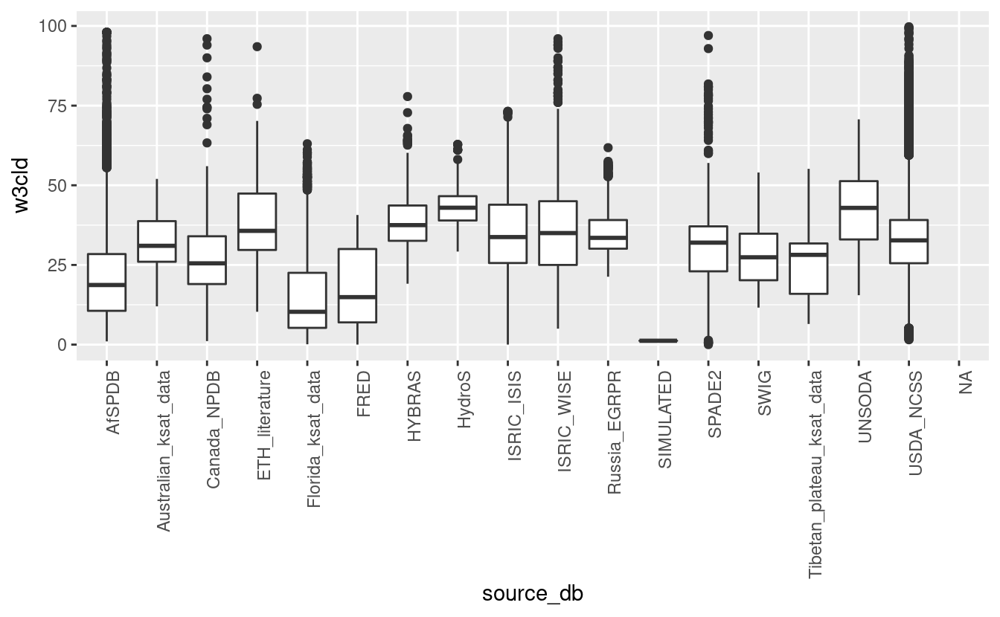
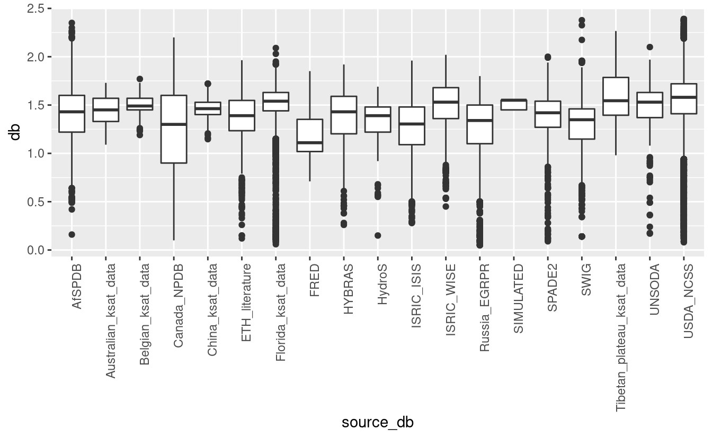
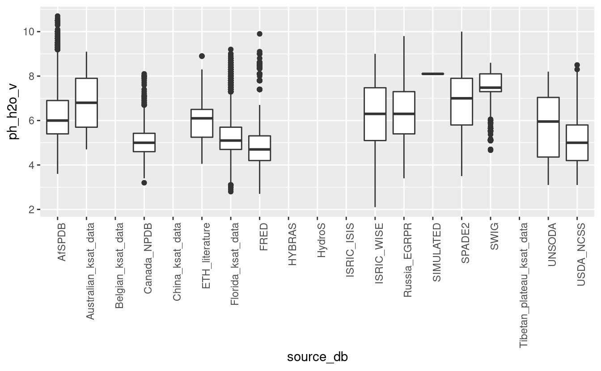
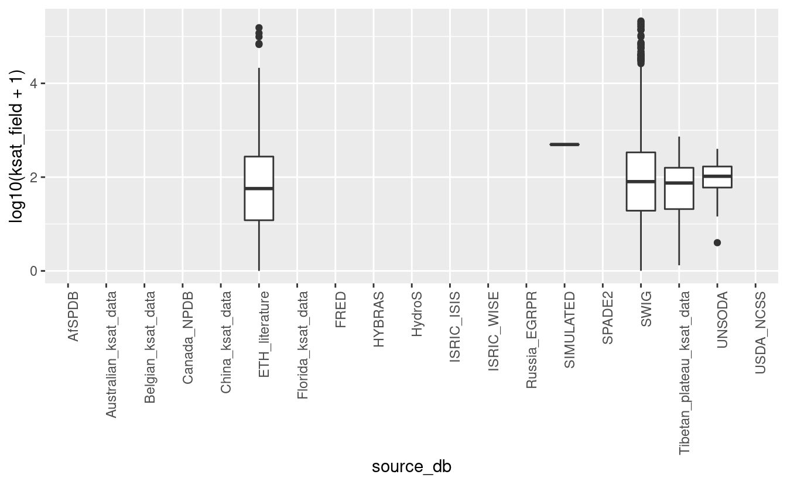
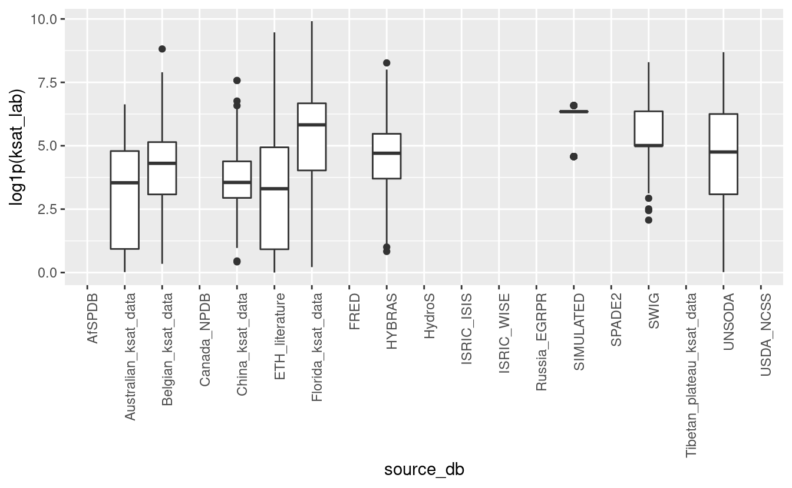
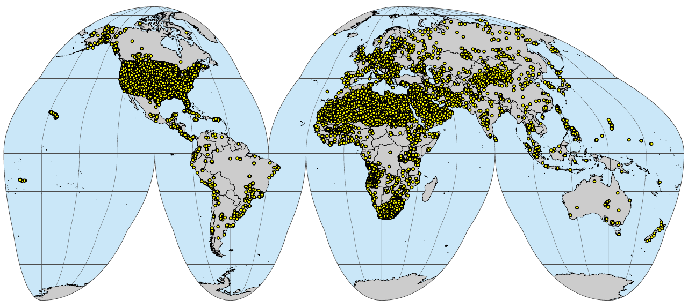
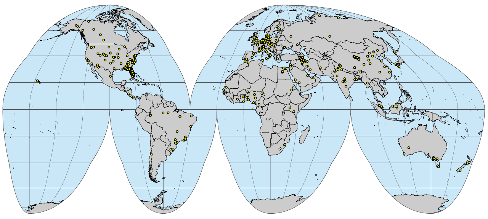

# Soil physical and hydrological properties

::: {.rmdnote}
You are reading the work-in-progress An Open Compendium of Soil Sample and Soil Profile Datasets. This chapter is currently draft version, a peer-review publication is pending. You can find the polished first edition at <https://opengeohub.github.io/SoilSamples/>.
:::

Last update:  2023-05-10


## Overview

This section describes import steps used to produce a global compilation of soil 
laboratory data with physicals and hydraulic soil properties that can be then 
used for predictive soil mapping / modeling at global and regional scales.

Read more about computing with soil hydraulic / physical properties in R:

- Gupta, S., Hengl, T., Lehmann, P., Bonetti, S., and Or, D. [**SoilKsatDB: global soil saturated hydraulic conductivity measurements for geoscience applications**](https://doi.org/10.5194/essd-2020-149). Earth Syst. Sci. Data Discuss., https://doi.org/10.5194/essd-2020-149, in review, 2021.
- de Sousa, D. F., Rodrigues, S., de Lima, H. V., & Chagas, L. T. (2020). [R software packages as a tool for evaluating soil physical and hydraulic properties](https://doi.org/10.1016/j.compag.2019.105077). Computers and Electronics in Agriculture, 168, 105077. 

##  Specifications

#### Data standards


- Metadata information: ["Soil Survey Investigation Report No. 42."](https://www.nrcs.usda.gov/Internet/FSE_DOCUMENTS/stelprdb1253872.pdf) and ["Soil Survey Investigation Report No. 45."](https://www.nrcs.usda.gov/Internet/FSE_DOCUMENTS/nrcs142p2_052226.pdf)
- Model DB: [National Cooperative Soil Survey (NCSS) Soil Characterization Database](https://ncsslabdatamart.sc.egov.usda.gov/)

#### _Target variables:_


```r
site.names = c("site_key", "usiteid", "site_obsdate", "longitude_decimal_degrees", "latitude_decimal_degrees", "location_accuracy_min", "location_accuracy_max")
hor.names = c("labsampnum","site_key","layer_sequence","hzn_top","hzn_bot","hzn_desgn","db_13b", "db_od", "COLEws", "w6clod", "w10cld", "w3cld", "w15l2", "w15bfm", "adod", "wrd_ws13", "cec7_cly", "w15cly", "tex_psda", "clay_tot_psa", "silt_tot_psa", "sand_tot_psa", "oc", "ph_kcl", "ph_h2o", "cec_sum", "cec_nh4", "wpg2", "ksat_lab", "ksat_field")
## target structure:
col.names = c("site_key", "usiteid", "site_obsdate", "longitude_decimal_degrees", "latitude_decimal_degrees", "location_accuracy_min", "location_accuracy_max", "labsampnum", "layer_sequence", "hzn_top", "hzn_bot", "hzn_desgn", "db_13b", "db_od", "COLEws", "w6clod", "w10cld", "w3cld", "w15l2", "w15bfm", "adod", "wrd_ws13", "cec7_cly", "w15cly", "tex_psda", "clay_tot_psa", "silt_tot_psa", "sand_tot_psa", "oc", "ph_kcl", "ph_h2o", "cec_sum", "cec_nh4", "wpg2",  "ksat_lab", "ksat_field", "source_db", "confidence_degree", "project_url", "citation_url")
```

- `db_13b`: Bulk density (33kPa) in g/cm3 for <2mm soil fraction,
- `db`: Bulk density (unknown method) in g/cm3 for <2mm soil fraction,
- `COLEws`: Coefficient of Linear Extensibility (COLE) whole soil in ratio for <2mm soil fraction,
- `w6clod`: Water Content 6 kPa <2mm in % wt for <2mm soil fraction,
- `w10cld`: Water Content 10 kPa <2mm in % wt for <2mm soil fraction,
- `w3cld`: Water Content 33 kPa <2mm in % vol for <2mm soil fraction (Field Capacity),
- `w15l2`: Water Content 1500 kPa <2mm in % vol for <2mm soil fraction (Permanent Wilting Point),
- `w15bfm`: Water Content 1500 kPa moist  <2mm in % wt for <2mm soil fraction,
- `adod`: Air-Dry/Oven-Dry in ratio for <2mm soil fraction,
- `wrd_ws13`: Water Retention Difference whole soil, 1500-kPa suction and an upper limit of usually 33-kPa in cm3 / cm-3 for <2mm soil fraction,
- `cec7_cly`: CEC-7/Clay ratio in ratio for <2mm soil fraction,
- `w15cly`: CEC/Clay ratio at 1500 kPa in ratio for <2mm soil fraction,
- `tex_psda`: Texture Determined, PSDA in factor for <2mm soil fraction,
- `clay_tot_psa`: Total Clay, <0.002 mm (<2 µm) in % wt for <2mm soil fraction,
- `silt_tot_psa`: Total Silt, 0.002-0.05 mm in % wt for <2mm soil fraction,
- `sand_tot_psa`: Total Sand, 0.05-2.0 mm in % wt for <2mm soil fraction,
- `wpg2`: Coarse fragments >2-mm weight fraction  in % wt for <2mm soil fraction,
- `hzn_top`: The top (upper) depth of the layer in centimeters. in cm for <2mm soil fraction,
- `hzn_bot`: The bottom (lower) depth of the layer in centimeters. in cm for <2mm soil fraction,
- `oc_v`: Organic carbon (unknown method) in % wt for <2mm soil fraction,
- `ph_kcl`: pH, 1N KCl in ratio for <2mm soil fraction,
- `ph_h2o_v`: pH in water (unknown method) for <2mm soil fraction,
- `cec_sum`: Sum of Cations (CEC-8.2) in cmol(+)/kg for <2mm soil fraction,
- `cec_nh4`: NH4OAc, pH 7 (CEC-7) in cmol(+)/kg for <2mm soil fraction,
- `ksat_field`: Field-estimated Saturated Hydraulic Conductivity in cm/day for <2mm soil fraction,
- `ksat_lab`: Laboratory-estimated Saturated Hydraulic Conductivity in cm/day for <2mm soil fraction,

Same variable names have been adjusted (e.g. `ph_h2o` to `ph_h2o_na`) to include `unknown method` so that variables from different laboratory methods can be seamlessly merged.

Conversion between VWC and MWC is based on the formula [@landon1991handbook; @benham1998field; @vanReeuwijk1993procedures]:

- VWC (%v/v) = MWC (% by weight ) * bulk density (kg/m3)

##  Data import

#### NCSS Characterization Database

- National Cooperative Soil Survey, (2020). [National Cooperative Soil Survey Characterization Database](http://ncsslabdatamart.sc.egov.usda.gov/). http://ncsslabdatamart.sc.egov.usda.gov/


```r
if(!exists("hydrosprops.NCSS")){
  ncss.site <- read.csv("/mnt/diskstation/data/Soil_points/INT/USDA_NCSS/NCSS_Site_Location.csv", stringsAsFactors = FALSE)
  #str(ncss.site)  
  ## Location accuracy unknown but we assume 100m
  ncss.site$location_accuracy_max = NA
  ncss.site$location_accuracy_min = 100
  ncss.layer <- read.csv("/mnt/diskstation/data/Soil_points/INT/USDA_NCSS/NCSS_Layer.csv", stringsAsFactors = FALSE)
  ncss.bdm <- read.csv("/mnt/diskstation/data/Soil_points/INT/USDA_NCSS/NCSS_Bulk_Density_and_Moisture.csv", stringsAsFactors = FALSE)
  #summary(as.factor(ncss.bdm$prep_code))
  ncss.bdm.0 <- ncss.bdm[ncss.bdm$prep_code=="S",]
  #summary(ncss.bdm.0$db_od)
  ## 0 values --- error!
  ncss.carb <- read.csv("/mnt/diskstation/data/Soil_points/INT/USDA_NCSS/NCSS_Carbon_and_Extractions.csv", stringsAsFactors = FALSE)
  ncss.organic <- read.csv("/mnt/diskstation/data/Soil_points/INT/USDA_NCSS/NCSS_Organic.csv", stringsAsFactors = FALSE)
  ncss.pH <- read.csv("/mnt/diskstation/data/Soil_points/INT/USDA_NCSS/NCSS_pH_and_Carbonates.csv", stringsAsFactors = FALSE)
  #str(ncss.pH)
  #summary(!is.na(ncss.pH$ph_h2o))
  ncss.PSDA <- read.csv("/mnt/diskstation/data/Soil_points/INT/USDA_NCSS/NCSS_PSDA_and_Rock_Fragments.csv", stringsAsFactors = FALSE)
  ncss.CEC <- read.csv("/mnt/diskstation/data/Soil_points/INT/USDA_NCSS/NCSS_CEC_and_Bases.csv")
  ncss.horizons <- plyr::join_all(list(ncss.bdm.0, ncss.layer, ncss.carb, ncss.organic, ncss.pH, ncss.PSDA, ncss.CEC), type = "left", by="labsampnum")
  #head(ncss.horizons)
  nrow(ncss.horizons)
  ncss.horizons$ksat_lab = NA; ncss.horizons$ksat_field = NA 
  hydrosprops.NCSS = plyr::join(ncss.site[,site.names], ncss.horizons[,hor.names], by="site_key")
  ## soil organic carbon:
  #summary(!is.na(hydrosprops.NCSS$oc)) 
  #summary(!is.na(hydrosprops.NCSS$ph_h2o)) 
  #summary(!is.na(hydrosprops.NCSS$ph_kcl)) 
  hydrosprops.NCSS$source_db = "USDA_NCSS"
  #str(hydrosprops.NCSS)
  #hist(hydrosprops.NCSS$w3cld[hydrosprops.NCSS$w3cld<150], breaks=45, col="gray")
  ## ERROR: MANY VALUES >100%
  ## fills in missing BD values using formula from Köchy, Hiederer, and Freibauer (2015)
  db.f = ifelse(is.na(hydrosprops.NCSS$db_13b), -0.31*log(hydrosprops.NCSS$oc)+1.38, hydrosprops.NCSS$db_13b)
  db.f[db.f<0.02 | db.f>2.87] = NA
  ## Convert to volumetric % to match most of world data sets:
  hydrosprops.NCSS$w3cld = hydrosprops.NCSS$w3cld * db.f
  hydrosprops.NCSS$w15l2 = hydrosprops.NCSS$w15l2 * db.f
  hydrosprops.NCSS$w10cld = hydrosprops.NCSS$w10cld * db.f
  #summary(as.factor(hydrosprops.NCSS$tex_psda))
  ## texture classes need to be cleaned up!
  ## check WRC values for sandy soils
  #hydrosprops.NCSS[which(!is.na(hydrosprops.NCSS$w3cld) & hydrosprops.NCSS$sand_tot_psa>95)[1:10],]
  ## check WRC values for ORGANIC soils
  #hydrosprops.NCSS[which(!is.na(hydrosprops.NCSS$w3cld) & hydrosprops.NCSS$oc>12)[1:10],]
  ## w3cld > 100?
  hydrosprops.NCSS$confidence_degree = 1
  hydrosprops.NCSS$project_url = "http://ncsslabdatamart.sc.egov.usda.gov/"
  hydrosprops.NCSS$citation_url = "https://doi.org/10.2136/sssaj2016.11.0386n"
  hydrosprops.NCSS = complete.vars(hydrosprops.NCSS)
  saveRDS.gz(hydrosprops.NCSS, "/mnt/diskstation/data/Soil_points/INT/USDA_NCSS/hydrosprops.NCSS.rds")
}
dim(hydrosprops.NCSS)
#> [1] 113991     40
```

#### Africa soil profiles database

- Leenaars, J. G., Van OOstrum, A. J. M., & Ruiperez Gonzalez, M. (2014). [Africa soil profiles database version 1.2. A compilation of georeferenced and standardized legacy soil profile data for Sub-Saharan Africa (with dataset)](https://www.isric.org/projects/africa-soil-profiles-database-afsp). Wageningen: ISRIC Report 2014/01; 2014.


```r
if(!exists("hydrosprops.AfSPDB")){
  require(foreign)
  afspdb.profiles <- read.dbf("/mnt/diskstation/data/Soil_points/AF/AfSIS_SPDB/AfSP012Qry_Profiles.dbf", as.is=TRUE)
  ## approximate location error
  afspdb.profiles$location_accuracy_min = afspdb.profiles$XYAccur * 1e5
  afspdb.profiles$location_accuracy_min = ifelse(afspdb.profiles$location_accuracy_min < 20, NA, afspdb.profiles$location_accuracy_min)
  afspdb.profiles$location_accuracy_max = NA
  afspdb.layers <- read.dbf("/mnt/diskstation/data/Soil_points/AF/AfSIS_SPDB/AfSP012Qry_Layers.dbf", as.is=TRUE)
  ## select columns of interest:
  afspdb.s.lst <- c("ProfileID", "usiteid", "T_Year", "X_LonDD", "Y_LatDD", "location_accuracy_min", "location_accuracy_max")
  ## Convert to weight content
  #summary(afspdb.layers$BlkDens)
  ## select layers
  afspdb.h.lst <- c("LayerID", "ProfileID", "LayerNr", "UpDpth", "LowDpth", "HorDes", "db_13b", "BlkDens", "COLEws", "VMCpF18", "VMCpF20", "VMCpF25", "VMCpF42", "w15bfm", "adod", "wrd_ws13", "cec7_cly", "w15cly", "LabTxtr", "Clay", "Silt", "Sand", "OrgC", "PHKCl", "PHH2O", "CecSoil", "cec_nh4", "CfPc", "ksat_lab", "ksat_field")
  ## add missing columns
  for(j in c("usiteid")){  afspdb.profiles[,j] = NA }
  for(j in c("db_13b", "COLEws", "w15bfm", "adod", "wrd_ws13", "cec7_cly", "w15cly", "cec_nh4", "ksat_lab", "ksat_field")){  afspdb.layers[,j] = NA }
  hydrosprops.AfSPDB = plyr::join(afspdb.profiles[,afspdb.s.lst], afspdb.layers[,afspdb.h.lst])
  for(j in 1:ncol(hydrosprops.AfSPDB)){ 
    if(is.numeric(hydrosprops.AfSPDB[,j])) { hydrosprops.AfSPDB[,j] <- ifelse(hydrosprops.AfSPDB[,j] < -200, NA, hydrosprops.AfSPDB[,j]) }
  }
  hydrosprops.AfSPDB$source_db = "AfSPDB"
  hydrosprops.AfSPDB$confidence_degree = 5
  hydrosprops.AfSPDB$OrgC = hydrosprops.AfSPDB$OrgC/10
  #summary(hydrosprops.AfSPDB$OrgC)
  hydrosprops.AfSPDB$project_url = "https://www.isric.org/projects/africa-soil-profiles-database-afsp"
  hydrosprops.AfSPDB$citation_url = "https://www.isric.org/sites/default/files/isric_report_2014_01.pdf"  
  hydrosprops.AfSPDB = complete.vars(hydrosprops.AfSPDB, sel = c("VMCpF25", "VMCpF42"), coords = c("X_LonDD", "Y_LatDD"))
  saveRDS.gz(hydrosprops.AfSPDB, "/mnt/diskstation/data/Soil_points/AF/AfSIS_SPDB/hydrosprops.AfSPDB.rds")
}
dim(hydrosprops.AfSPDB)
#> [1] 10720    40
```

#### ISRIC ISIS

- Batjes, N. H. (1995). [A homogenized soil data file for global environmental research: A subset of FAO, ISRIC and NRCS profiles (Version 1.0) (No. 95/10b)](https://www.isric.org/sites/default/files/isric_report_1995_10b.pdf). ISRIC.
- Van de Ven, T., & Tempel, P. (1994). ISIS 4.0: ISRIC Soil Information System: User Manual. ISRIC.


```r
if(!exists("hydrosprops.ISIS")){
  isis.xy <- read.csv("/mnt/diskstation/data/Soil_points/INT/ISRIC_ISIS/Sites.csv", stringsAsFactors = FALSE)
  #str(isis.xy)
  isis.des <- read.csv("/mnt/diskstation/data/Soil_points/INT/ISRIC_ISIS/SitedescriptionResults.csv", stringsAsFactors = FALSE)
  isis.site <- data.frame(site_key=isis.xy$Id, usiteid=paste(isis.xy$CountryISO, isis.xy$SiteNumber, sep=""))
  id0.lst = c(236,235,224)
  nm0.lst = c("longitude_decimal_degrees", "latitude_decimal_degrees", "site_obsdate")
  isis.site.l = plyr::join_all(lapply(1:length(id0.lst), function(i){plyr::rename(subset(isis.des, ValueId==id0.lst[i])[,c("SampleId","Value")], replace=c("SampleId"="site_key", "Value"=paste(nm0.lst[i])))}), type = "full")
  isis.site.df = join(isis.site, isis.site.l)
  for(j in nm0.lst){ isis.site.df[,j] <- as.numeric(isis.site.df[,j]) }
  isis.site.df[isis.site.df$usiteid=="CI2","latitude_decimal_degrees"] = 5.883333
  #str(isis.site.df)
  isis.site.df$location_accuracy_min = 100
  isis.site.df$location_accuracy_max = NA
  isis.smp <- read.csv("/mnt/diskstation/data/Soil_points/INT/ISRIC_ISIS/AnalyticalSamples.csv", stringsAsFactors = FALSE)
  isis.ana <- read.csv("/mnt/diskstation/data/Soil_points/INT/ISRIC_ISIS/AnalyticalResults.csv", stringsAsFactors = FALSE)
  #str(isis.ana)
  isis.class <- read.csv("/mnt/diskstation/data/Soil_points/INT/ISRIC_ISIS/ClassificationResults.csv", stringsAsFactors = FALSE)
  isis.hor <- data.frame(labsampnum=isis.smp$Id, hzn_top=isis.smp$Top, hzn_bot=isis.smp$Bottom, site_key=isis.smp$SiteId)
  isis.hor$hzn_bot <- as.numeric(gsub(">", "", isis.hor$hzn_bot))
  #str(isis.hor)
  id.lst = c(1,2,22,4,28,31,32,14,34,38,39,42)
  nm.lst = c("ph_h2o","ph_kcl","wpg2","oc","sand_tot_psa","silt_tot_psa","clay_tot_psa","cec_sum","db_od","w10cld","w3cld", "w15l2")
  #str(as.numeric(isis.ana$Value[isis.ana$ValueId==38]))
  isis.hor.l = plyr::join_all(lapply(1:length(id.lst), function(i){plyr::rename(subset(isis.ana, ValueId==id.lst[i])[,c("SampleId","Value")], replace=c("SampleId"="labsampnum", "Value"=paste(nm.lst[i])))}), type = "full")
  #summary(as.numeric(isis.hor.l$w3cld))
  isis.hor.df = join(isis.hor, isis.hor.l)
  isis.hor.df = isis.hor.df[!duplicated(isis.hor.df$labsampnum),]
  #summary(as.numeric(isis.hor.df$w3cld))
  for(j in nm.lst){ isis.hor.df[,j] <- as.numeric(isis.hor.df[,j]) }
  #str(isis.hor.df)
  ## add missing columns
  for(j in c("layer_sequence", "hzn_desgn", "tex_psda", "COLEws", "w15bfm", "adod", "wrd_ws13", "cec7_cly", "w15cly", "cec_nh4", "db_13b", "w6clod", "ksat_lab", "ksat_field")){  isis.hor.df[,j] = NA }
  which(!hor.names %in% names(isis.hor.df))
  hydrosprops.ISIS <- join(isis.site.df[,site.names], isis.hor.df[,hor.names], type="left")
  hydrosprops.ISIS$source_db = "ISRIC_ISIS"
  hydrosprops.ISIS$confidence_degree = 1
  hydrosprops.ISIS$project_url = "https://isis.isric.org"
  hydrosprops.ISIS$citation_url = "https://www.isric.org/sites/default/files/isric_report_1995_10b.pdf"
  hydrosprops.ISIS = complete.vars(hydrosprops.ISIS)
  saveRDS.gz(hydrosprops.ISIS, "/mnt/diskstation/data/Soil_points/INT/ISRIC_ISIS/hydrosprops.ISIS.rds")
}
dim(hydrosprops.ISIS)
#> [1] 1176   40
```

#### ISRIC WISE

- Batjes, N.H. (2019). [Harmonized soil profile data for applications at global and continental scales: updates to the WISE database](http://dx.doi.org/10.1111/j.1475-2743.2009.00202.x). Soil Use and Management 5:124–127.


```r
if(!exists("hydrosprops.WISE")){
  wise.SITE <- read.csv("/mnt/diskstation/data/Soil_points/INT/ISRIC_WISE/WISE3_SITE.csv", stringsAsFactors=FALSE)
  #summary(as.factor(wise.SITE$LONLAT_ACC))
  wise.SITE$location_accuracy_min = ifelse(wise.SITE$LONLAT_ACC=="D", 1e5/2, ifelse(wise.SITE$LONLAT_ACC=="S", 30, ifelse(wise.SITE$LONLAT_ACC=="M", 1800/2, NA)))
  wise.SITE$location_accuracy_max = NA
  wise.HORIZON <- read.csv("/mnt/diskstation/data/Soil_points/INT/ISRIC_WISE/WISE3_HORIZON.csv")
  wise.s.lst <- c("WISE3_id", "SOURCE_ID", "DATEYR", "LONDD", "LATDD", "location_accuracy_min", "location_accuracy_max")
  ## Volumetric values
  #summary(wise.HORIZON$BULKDENS)
  #summary(wise.HORIZON$VMC1)
  wise.HORIZON$WISE3_id = wise.HORIZON$WISE3_ID
  wise.h.lst <- c("labsampnum", "WISE3_id", "HONU", "TOPDEP", "BOTDEP", "DESIG", "db_13b", "BULKDENS", "COLEws", "w6clod", "VMC1", "VMC2", "VMC3", "w15bfm", "adod", "wrd_ws13", "cec7_cly", "w15cly", "tex_psda", "CLAY", "SILT", "SAND", "ORGC", "PHKCL", "PHH2O", "CECSOIL", "cec_nh4", "GRAVEL", "ksat_lab", "ksat_field")
  ## add missing columns
  for(j in c("labsampnum", "db_13b", "COLEws", "w15bfm", "w6clod", "adod", "wrd_ws13", "cec7_cly", "w15cly", "tex_psda", "cec_nh4", "ksat_lab", "ksat_field")){  wise.HORIZON[,j] = NA }
  hydrosprops.WISE = plyr::join(wise.SITE[,wise.s.lst], wise.HORIZON[,wise.h.lst])
  for(j in 1:ncol(hydrosprops.WISE)){ 
    if(is.numeric(hydrosprops.WISE[,j])) { hydrosprops.WISE[,j] <- ifelse(hydrosprops.WISE[,j] < -200, NA, hydrosprops.WISE[,j]) }
  }
  hydrosprops.WISE$ORGC = hydrosprops.WISE$ORGC/10
  hydrosprops.WISE$source_db = "ISRIC_WISE"
  hydrosprops.WISE$project_url = "https://isric.org"
  hydrosprops.WISE$citation_url = "http://dx.doi.org/10.1111/j.1475-2743.2009.00202.x"
  hydrosprops.WISE <- complete.vars(hydrosprops.WISE, sel=c("VMC2", "VMC3"), coords = c("LONDD", "LATDD"))
  hydrosprops.WISE$confidence_degree = 5
  #summary(hydrosprops.WISE$VMC3)
  saveRDS.gz(hydrosprops.WISE, "/mnt/diskstation/data/Soil_points/INT/ISRIC_WISE/hydrosprops.WISE.rds")
}
dim(hydrosprops.WISE)
#> [1] 1325   40
```

#### Fine Root Ecology Database (FRED)

- Iversen CM, Powell AS, McCormack ML, Blackwood CB, Freschet GT, Kattge J, Roumet C, Stover DB, Soudzilovskaia NA, Valverde-Barrantes OJ, van Bodegom PM, Violle C. 2018. Fine-Root Ecology Database (FRED): A Global Collection of Root Trait Data with Coincident Site, Vegetation, Edaphic, and Climatic Data, Version 2. Oak Ridge National Laboratory, TES SFA, U.S. Department of Energy, Oak Ridge, Tennessee, U.S.A. Access on-line at: https://doi.org/10.25581/ornlsfa.012/1417481.


```r
if(!exists("hydrosprops.FRED")){
  fred = read.csv("/mnt/diskstation/data/Soil_points/INT/FRED/FRED2_20180518.csv", skip = 5, header=FALSE)
  names(fred) = names(read.csv("/mnt/diskstation/data/Soil_points/INT/FRED/FRED2_20180518.csv", nrows=1, header=TRUE))
  fred.h.lst = c("Notes_Row.ID", "Data.source_DOI", "site_obsdate", "longitude_decimal_degrees", "latitude_decimal_degrees", "location_accuracy_min", "location_accuracy_max", "labsampnum", "layer_sequence", "hzn_top", "hzn_bot", "Soil.horizon", "db_13b", "Soil.bulk.density", "COLEws", "w6clod", "w10cld", "Soil.water_Volumetric.content", "w15l2", "w15bfm", "adod", "wrd_ws13", "cec7_cly", "w15cly", "Soil.texture", "Soil.texture_Fraction.clay", "Soil.texture_Fraction.silt", "Soil.texture_Fraction.sand", "Soil.organic.C.content", "ph_kcl", "Soil.pH_Water", "Soil.cation.exchange.capacity..CEC.", "cec_nh4", "wpg2",  "ksat_lab", "ksat_field")
  #summary(fred$Soil.water_Volumetric.content)
  #summary(fred$Soil.water_Storage.capacity)
  fred$site_obsdate = rowMeans(fred[,c("Sample.collection_Year.ending.collection", "Sample.collection_Year.beginning.collection")], na.rm=TRUE)
  #summary(fred$site_obsdate)
  fred$longitude_decimal_degrees = ifelse(is.na(fred$Longitude), fred$Longitude_Estimated, fred$Longitude)
  fred$latitude_decimal_degrees = ifelse(is.na(fred$Latitude), fred$Latitude_Estimated, fred$Latitude)
  #summary(as.factor(fred$Soil.horizon))
  fred$hzn_bot = ifelse(is.na(fred$Soil.depth_Lower.sampling.depth), fred$Soil.depth - 5, fred$Soil.depth_Lower.sampling.depth)
  fred$hzn_top = ifelse(is.na(fred$Soil.depth_Upper.sampling.depth), fred$Soil.depth + 5, fred$Soil.depth_Upper.sampling.depth)
  x.na = fred.h.lst[which(!fred.h.lst %in% names(fred))]
  if(length(x.na)>0){ for(i in x.na){ fred[,i] = NA } }
  hydrosprops.FRED = fred[,fred.h.lst]
  #plot(hydrosprops.FRED[,4:5])
  hydrosprops.FRED$source_db = "FRED"
  hydrosprops.FRED$confidence_degree = 5
  hydrosprops.FRED$project_url = "https://roots.ornl.gov/"
  hydrosprops.FRED$citation_url = "https://doi.org/10.25581/ornlsfa.012/1417481"
  hydrosprops.FRED = complete.vars(hydrosprops.FRED, sel = c("Soil.water_Volumetric.content", "Soil.texture_Fraction.clay"))
  saveRDS.gz(hydrosprops.FRED, "/mnt/diskstation/data/Soil_points/INT/FRED/hydrosprops.FRED.rds")
}
dim(hydrosprops.FRED)
#> [1] 3761   40
```


#### EGRPR

- [Russian Federation: The Unified State Register of Soil Resources (EGRPR)](http://egrpr.esoil.ru/).


```r
if(!exists("hydrosprops.EGRPR")){
  russ.HOR = read.csv("/mnt/diskstation/data/Soil_points/Russia/EGRPR/Russia_EGRPR_soil_pedons.csv")
  russ.HOR$SOURCEID = paste(russ.HOR$CardID, russ.HOR$SOIL_ID, sep="_")
  russ.HOR$SNDPPT <- russ.HOR$TEXTSAF + russ.HOR$TEXSCM
  russ.HOR$SLTPPT <- russ.HOR$TEXTSIC + russ.HOR$TEXTSIM + 0.8 * russ.HOR$TEXTSIF
  russ.HOR$CLYPPT <- russ.HOR$TEXTCL + 0.2 * russ.HOR$TEXTSIF
  ## Correct texture fractions:
  sumTex <- rowSums(russ.HOR[,c("SLTPPT","CLYPPT","SNDPPT")])
  russ.HOR$SNDPPT <- russ.HOR$SNDPPT / ((sumTex - russ.HOR$CLYPPT) /(100 - russ.HOR$CLYPPT))
  russ.HOR$SLTPPT <- russ.HOR$SLTPPT / ((sumTex - russ.HOR$CLYPPT) /(100 - russ.HOR$CLYPPT))
  russ.HOR$oc <- russ.HOR$ORGMAT/1.724
  ## add missing columns
  for(j in c("site_obsdate", "location_accuracy_min", "location_accuracy_max", "labsampnum", "db_13b", "COLEws", "w15bfm", "w6clod", "adod", "wrd_ws13", "cec7_cly", "w15cly", "tex_psda", "cec_nh4", "wpg2", "ksat_lab", "ksat_field")){  russ.HOR[,j] = NA }
  russ.sel.h = c("SOURCEID", "SOIL_ID", "site_obsdate", "LONG", "LAT", "location_accuracy_min", "location_accuracy_max", "labsampnum", "HORNMB", "HORTOP", "HORBOT", "HISMMN", "db_13b", "DVOL", "COLEws", "w6clod", "WR10", "WR33", "WR1500", "w15bfm", "adod", "wrd_ws13", "cec7_cly", "w15cly", "tex_psda", "CLYPPT", "SLTPPT", "SNDPPT", "oc", "PHSLT", "PHH2O", "CECST", "cec_nh4", "wpg2","ksat_lab", "ksat_field")
  hydrosprops.EGRPR = russ.HOR[,russ.sel.h]
  hydrosprops.EGRPR$source_db = "Russia_EGRPR"
  hydrosprops.EGRPR$confidence_degree = 2
  hydrosprops.EGRPR$project_url = "http://egrpr.esoil.ru/"
  hydrosprops.EGRPR$citation_url = "https://doi.org/10.19047/0136-1694-2016-86-115-123"
  hydrosprops.EGRPR <- complete.vars(hydrosprops.EGRPR, sel=c("WR33", "WR1500"), coords = c("LONG", "LAT"))
  #summary(hydrosprops.EGRPR$WR1500)
  saveRDS.gz(hydrosprops.EGRPR, "/mnt/diskstation/data/Soil_points/Russia/EGRPR/hydrosprops.EGRPR.rds")
}
dim(hydrosprops.EGRPR)
#> [1] 1138   40
```

#### SPADE-2

- Hannam J.A., Hollis, J.M., Jones, R.J.A., Bellamy, P.H., Hayes, S.E., Holden, A., Van Liedekerke, M.H. and Montanarella, L. (2009). [SPADE-2: The soil profile analytical database for Europe, Version 2.0 Beta Version March 2009](https://esdac.jrc.ec.europa.eu/content/soil-profile-analytical-database-2). Unpublished Report, 27pp.
- Kristensen, J. A., Balstrøm, T., Jones, R. J. A., Jones, A., Montanarella, L., Panagos, P., and Breuning-Madsen, H.: Development of a harmonised soil profile analytical database for Europe: a resource for supporting regional soil management, SOIL, 5, 289–301, https://doi.org/10.5194/soil-5-289-2019, 2019.


```r
if(!exists("hydrosprops.SPADE2")){
  spade.PLOT <- read.csv("/mnt/diskstation/data/Soil_points/EU/SPADE/DAT_PLOT.csv")
  #str(spade.PLOT)
  spade.HOR <- read.csv("/mnt/diskstation/data/Soil_points/EU/SPADE/DAT_HOR.csv")
  spade.PLOT = spade.PLOT[!spade.PLOT$LON_COOR_V>180 & spade.PLOT$LAT_COOR_V>20,]
  #plot(spade.PLOT[,c("LON_COOR_V","LAT_COOR_V")])
  spade.PLOT$location_accuracy_min = 100
  spade.PLOT$location_accuracy_max = NA
  #site.names = c("site_key", "usiteid", "site_obsdate", "longitude_decimal_degrees", "latitude_decimal_degrees")
  spade.PLOT$ProfileID = paste(spade.PLOT$CNTY_C, spade.PLOT$PLOT_ID, sep="_")
  spade.PLOT$T_Year = 2009
  spade.s.lst <- c("PLOT_ID", "ProfileID", "T_Year", "LON_COOR_V", "LAT_COOR_V", "location_accuracy_min", "location_accuracy_max")
  ## standardize:
  spade.HOR$SLTPPT <- spade.HOR$SILT1_V + spade.HOR$SILT2_V
  spade.HOR$SNDPPT <- spade.HOR$SAND1_V + spade.HOR$SAND2_V + spade.HOR$SAND3_V
  spade.HOR$PHIKCL <- NA
  spade.HOR$PHIKCL[which(spade.HOR$PH_M %in% "A14")] <- spade.HOR$PH_V[which(spade.HOR$PH_M %in% "A14")]
  spade.HOR$PHIHO5 <- NA
  spade.HOR$PHIHO5[which(spade.HOR$PH_M %in% "A12")] <- spade.HOR$PH_V[which(spade.HOR$PH_M %in% "A12")]
  #summary(spade.HOR$BD_V)
  for(j in c("site_obsdate", "layer_sequence", "db_13b", "COLEws", "w15bfm", "w6clod", "w10cld", "adod", "wrd_ws13", "w15bfm", "cec7_cly", "w15cly", "tex_psda", "cec_nh4", "ksat_lab", "ksat_field")){  spade.HOR[,j] = NA }
  spade.h.lst = c("HOR_ID","PLOT_ID","layer_sequence","HOR_BEG_V","HOR_END_V","HOR_NAME","db_13b", "BD_V", "COLEws", "w6clod", "w10cld", "WCFC_V", "WC4_V", "w15bfm", "adod", "wrd_ws13", "cec7_cly", "w15cly", "tex_psda", "CLAY_V", "SLTPPT", "SNDPPT", "OC_V", "PHIKCL", "PHIHO5", "CEC_V", "cec_nh4", "GRAV_C", "ksat_lab", "ksat_field")
  hydrosprops.SPADE2 = plyr::join(spade.PLOT[,spade.s.lst], spade.HOR[,spade.h.lst])
  hydrosprops.SPADE2$source_db = "SPADE2"
  hydrosprops.SPADE2$confidence_degree = 15
  hydrosprops.SPADE2$project_url = "https://esdac.jrc.ec.europa.eu/content/soil-profile-analytical-database-2"
  hydrosprops.SPADE2$citation_url = "https://doi.org/10.1016/j.landusepol.2011.07.003"
  hydrosprops.SPADE2 <- complete.vars(hydrosprops.SPADE2, sel=c("WCFC_V", "WC4_V"), coords = c("LON_COOR_V","LAT_COOR_V"))
  #summary(hydrosprops.SPADE2$WC4_V)
  #summary(is.na(hydrosprops.SPADE2$WC4_V))
  #hist(hydrosprops.SPADE2$WC4_V, breaks=45, col="gray")
  saveRDS.gz(hydrosprops.SPADE2, "/mnt/diskstation/data/Soil_points/EU/SPADE/hydrosprops.SPADE2.rds")
}
dim(hydrosprops.SPADE2)
#> [1] 1182   40
```

#### Canada National Pedon Database

- [Agriculture and Agri-Food Canada National Pedon Database](https://open.canada.ca/data/en/dataset/6457fad6-b6f5-47a3-9bd1-ad14aea4b9e0).


```r
if(!exists("hydrosprops.NPDB")){
  NPDB.nm = c("NPDB_V2_sum_source_info.csv","NPDB_V2_sum_chemical.csv", "NPDB_V2_sum_horizons_raw.csv", "NPDB_V2_sum_physical.csv")
  NPDB.HOR = plyr::join_all(lapply(paste0("/mnt/diskstation/data/Soil_points/Canada/NPDB/", NPDB.nm), read.csv), type = "full")
  #str(NPDB.HOR)
  #summary(NPDB.HOR$BULK_DEN)
  ## 0 values -> ERROR!
  ## add missing columns
  NPDB.HOR$HISMMN = paste0(NPDB.HOR$HZN_MAS, NPDB.HOR$HZN_SUF, NPDB.HOR$HZN_MOD)
  for(j in c("usiteid", "location_accuracy_max", "layer_sequence", "labsampnum", "db_13b", "COLEws", "w15bfm", "w6clod", "w10cld", "adod", "wrd_ws13", "cec7_cly", "w15cly", "tex_psda", "cec_nh4", "ph_kcl", "ksat_lab", "ksat_field")){  NPDB.HOR[,j] = NA }
  npdb.sel.h = c("PEDON_ID", "usiteid", "CAL_YEAR", "DD_LONG", "DD_LAT", "CONF_METRS", "location_accuracy_max", "labsampnum", "layer_sequence", "U_DEPTH", "L_DEPTH", "HISMMN", "db_13b", "BULK_DEN", "COLEws", "w6clod", "w10cld", "RETN_33KP", "RETN_1500K", "RETN_HYGR", "adod", "wrd_ws13", "cec7_cly", "w15cly", "tex_psda", "T_CLAY", "T_SILT", "T_SAND", "CARB_ORG", "ph_kcl", "PH_H2O", "CEC", "cec_nh4", "VC_SAND", "ksat_lab", "ksat_field")
  hydrosprops.NPDB = NPDB.HOR[,npdb.sel.h]
  hydrosprops.NPDB$source_db = "Canada_NPDB"
  hydrosprops.NPDB$confidence_degree = 1
  hydrosprops.NPDB$project_url = "https://open.canada.ca/data/en/"
  hydrosprops.NPDB$citation_url = "https://open.canada.ca/data/en/dataset/6457fad6-b6f5-47a3-9bd1-ad14aea4b9e0"
  hydrosprops.NPDB <- complete.vars(hydrosprops.NPDB, sel=c("RETN_33KP", "RETN_1500K"), coords = c("DD_LONG", "DD_LAT"))
  saveRDS.gz(hydrosprops.NPDB, "/mnt/diskstation/data/Soil_points/Canada/NPDB/hydrosprops.NPDB.rds")
}
dim(hydrosprops.NPDB)
#> [1] 404  40
```

#### ETH imported data from literature

- Digitized soil hydraulic measurements from the literature by the [ETH Soil and Terrestrial Environmental Physics](https://step.ethz.ch/).


```r
if(!exists("hydrosprops.ETH")){
  xlsxFile = list.files(pattern="Global_soil_water_tables.xlsx", full.names = TRUE, recursive = TRUE)
  wb = openxlsx::getSheetNames(xlsxFile)
  eth.tbl = plyr::rbind.fill(
    openxlsx::read.xlsx(xlsxFile, sheet = "ETH_imported_literature"), 
    openxlsx::read.xlsx(xlsxFile, sheet = "ETH_imported_literature_more"),
    openxlsx::read.xlsx(xlsxFile, sheet = "ETH_extra_data set"),
    openxlsx::read.xlsx(xlsxFile, sheet = "Tibetan_plateau"),
    openxlsx::read.xlsx(xlsxFile, sheet = "Belgium_Vereecken_data"),
    openxlsx::read.xlsx(xlsxFile, sheet = "Australia_dataset"),
    openxlsx::read.xlsx(xlsxFile, sheet = "Florida_Soils_Ksat"),
    openxlsx::read.xlsx(xlsxFile, sheet = "China_dataset"),
    openxlsx::read.xlsx(xlsxFile, sheet = "Sand_dunes_Siberia_database"),
    openxlsx::read.xlsx(xlsxFile, sheet = "New_data_4_03")
  )
  #dim(eth.tbl)
  #summary(as.factor(eth.tbl$reference_source))
  ## Data quality tables
  lab.ql = openxlsx::read.xlsx(xlsxFile, sheet = "Quality_per_site_key")
  lab.cd = plyr::join(eth.tbl["site_key"], lab.ql)$confidence_degree
  eth.tbl$confidence_degree = ifelse(is.na(eth.tbl$confidence_degree), lab.cd, eth.tbl$confidence_degree)
  #summary(as.factor(eth.tbl$confidence_degree))
  ## missing columns
  for(j in c("usiteid", "labsampnum", "layer_sequence", "db_13b", "COLEws", "adod", "wrd_ws13", "w15bfm", "w15cly", "cec7_cly", "w6clod", "w10cld", "ph_kcl", "cec_sum", "cec_nh4", "wpg2", "project_url", "citation_url")){ eth.tbl[,j] = NA }
  hydrosprops.ETH = eth.tbl[,col.names]
  col.names[which(!col.names %in% names(eth.tbl))]
  hydrosprops.ETH$project_url = "https://step.ethz.ch/"
  hydrosprops.ETH$citation_url = "https://doi.org/10.5194/essd-2020-149"
  hydrosprops.ETH = complete.vars(hydrosprops.ETH)
  #hist(hydrosprops.ETH$w15l2, breaks=45, col="gray")
  #hist(log1p(hydrosprops.ETH$ksat_lab), breaks=45, col="gray")
  saveRDS.gz(hydrosprops.ETH, "/mnt/diskstation/data/Soil_points/INT/hydrosprops.ETH.rds")
}
dim(hydrosprops.ETH)
#> [1] 9023   40
```

#### HYBRAS

- Ottoni, M. V., Ottoni Filho, T. B., Schaap, M. G., Lopes-Assad, M. L. R., & Rotunno Filho, O. C. (2018). [Hydrophysical database for Brazilian soils (HYBRAS) and pedotransfer functions for water retention](http://www.cprm.gov.br/en/Hydrology/Research-and-Innovation/HYBRAS-4208.html). Vadose Zone Journal, 17(1).


```r
if(!exists("hydrosprops.HYBRAS")){
  hybras.HOR = openxlsx::read.xlsx(xlsxFile, sheet = "HYBRAS.V1_integrated_tables_RAW")
  #str(hybras.HOR)
  ## some points had only UTM coordinates and had to be manually coorected
  ## subset to unique values:
  hybras.HOR = hybras.HOR[!duplicated(hybras.HOR$site_key),]
  #summary(hybras.HOR$bulk_den)
  #hist(hybras.HOR$ksat, breaks=35, col="grey")
  ## add missing columns
  for(j in c("usiteid", "layer_sequence", "labsampnum", "db_13b", "COLEws", "w15bfm", "w6clod", "w10cld", "adod", "wrd_ws13", "cec7_cly", "w15cly", "cec_sum", "cec_nh4", "ph_kcl", "ph_h2o", "ksat_field", "uuid")){  hybras.HOR[,j] = NA }
  hybras.HOR$w3cld = rowMeans(hybras.HOR[,c("theta20","theta50")], na.rm = TRUE)
  hybras.sel.h = c("site_key", "usiteid", "year", "LongitudeOR", "LatitudeOR", "location_accuracy_min", "location_accuracy_max", "labsampnum", "layer_sequence", "top_depth", "bot_depth", "horizon", "db_13b", "bulk_den", "COLEws", "w6clod", "theta10", "w3cld", "theta15000", "satwat", "adod", "wrd_ws13", "cec7_cly", "w15cly", "tex_psda", "clay", "silt", "sand", "org_carb", "ph_kcl", "ph_h2o", "cec_sum", "cec_nh4", "vc_sand", "ksat", "ksat_field")
  hydrosprops.HYBRAS = hybras.HOR[,hybras.sel.h]
  hydrosprops.HYBRAS$source_db = "HYBRAS"
  hydrosprops.HYBRAS$confidence_degree = 1
  for(i in c("theta10", "w3cld", "theta15000", "satwat")){ hydrosprops.HYBRAS[,i] = hydrosprops.HYBRAS[,i]*100 }
  #summary(hydrosprops.HYBRAS$theta10)
  #summary(hydrosprops.HYBRAS$satwat)
  #hist(hydrosprops.HYBRAS$theta10, breaks=45, col="gray")
  #hist(log1p(hydrosprops.HYBRAS$ksat), breaks=45, col="gray")
  #summary(!is.na(hydrosprops.HYBRAS$ksat))
  hydrosprops.HYBRAS$project_url = "http://www.cprm.gov.br/en/Hydrology/Research-and-Innovation/HYBRAS-4208.html"
  hydrosprops.HYBRAS$citation_url = "https://doi.org/10.2136/vzj2017.05.0095"
  hydrosprops.HYBRAS <- complete.vars(hydrosprops.HYBRAS, sel=c("w3cld", "theta15000", "ksat", "ksat_field"), coords = c("LongitudeOR", "LatitudeOR"))
  saveRDS.gz(hydrosprops.HYBRAS, "/mnt/diskstation/data/Soil_points/INT/HYBRAS/hydrosprops.HYBRAS.rds")
}
dim(hydrosprops.HYBRAS)
#> [1] 814  40
```

#### UNSODA

- Nemes, Attila; Schaap, Marcel; Leij, Feike J.; Wösten, J. Henk M. (2015). [UNSODA 2.0: Unsaturated Soil Hydraulic Database](https://data.nal.usda.gov/dataset/unsoda-20-unsaturated-soil-hydraulic-database-database-and-program-indirect-methods-estimating-unsaturated-hydraulic-properties). Database and program for indirect methods of estimating unsaturated hydraulic properties. US Salinity Laboratory - ARS - USDA. https://doi.org/10.15482/USDA.ADC/1173246. Accessed 2020-06-08.


```r
if(!exists("hydrosprops.UNSODA")){
  unsoda.LOC = read.csv("/mnt/diskstation/data/Soil_points/INT/UNSODA/general_c.csv")
  #unsoda.LOC = unsoda.LOC[!unsoda.LOC$Lat==0,]
  #plot(unsoda.LOC[,c("Long","Lat")])
  unsoda.SOIL = read.csv("/mnt/diskstation/data/Soil_points/INT/UNSODA/soil_properties.csv")
  #summary(unsoda.SOIL$k_sat)
  ## Soil water retention in lab:
  tmp.hyd = read.csv("/mnt/diskstation/data/Soil_points/INT/UNSODA/lab_drying_h-t.csv")
  #str(tmp.hyd)
  tmp.hyd = tmp.hyd[!is.na(tmp.hyd$preshead),]
  tmp.hyd$theta = tmp.hyd$theta*100
  #head(tmp.hyd)
  pr.lst = c(6,10,33,15000)
  cl.lst = c("w6clod", "w10cld", "w3cld", "w15l2")
  tmp.hyd.tbl = data.frame(code=unique(tmp.hyd$code), w6clod=NA, w10cld=NA, w3cld=NA, w15l2=NA)
  for(i in 1:length(pr.lst)){
    tmp.hyd.tbl[,cl.lst[i]] = plyr::join(tmp.hyd.tbl, tmp.hyd[which(tmp.hyd$preshead==pr.lst[i]),c("code","theta")], match="first")$theta
  }
  #head(tmp.hyd.tbl)
  ## ksat
  kst.lev = read.csv("/mnt/diskstation/data/Soil_points/INT/UNSODA/comment_lab_sat_cond.csv", na.strings=c("","NA","No comment"))
  kst.met = read.csv("/mnt/diskstation/data/Soil_points/INT/UNSODA/methodology.csv", na.strings=c("","NA","No comment"))
  kst.met$comment_lsc = paste(plyr::join(kst.met[c("comment_lsc_ID")], kst.lev)$comment_lsc)
  kst.met$comment_lsc[which(kst.met$comment_lsc=="NA")] = NA
  kst.fld = read.csv("/mnt/diskstation/data/Soil_points/INT/UNSODA/comment_field_sat_cond.csv", na.strings=c("","NA","No comment"))
  kst.met$comment_fsc = paste(plyr::join(kst.met[c("comment_fsc_ID")], kst.fld)$comment_fsc)
  kst.met$comment_fsc[which(kst.met$comment_fsc=="NA")] = NA
  summary(as.factor(kst.met$comment_lsc))
  kst.met$comment_met = ifelse(is.na(kst.met$comment_lsc)&!is.na(kst.met$comment_fsc), paste("field", kst.met$comment_fsc), paste("lab", kst.met$comment_lsc))
  unsoda.SOIL$comment_met = paste(plyr::join(unsoda.SOIL[c("code")], kst.met)$comment_met)
  #summary(as.factor(unsoda.SOIL$comment_met))
  sel.fld = unsoda.SOIL$comment_met %in% c("field Double ring infiltrometer","field Ponding", "field Steady infiltration")
  unsoda.SOIL$ksat_lab[which(!sel.fld)] = unsoda.SOIL$k_sat[which(!sel.fld)]
  unsoda.SOIL$ksat_field[is.na(unsoda.SOIL$ksat_lab)] = unsoda.SOIL$k_sat[is.na(unsoda.SOIL$ksat_lab)]
  unsoda.col = join_all(list(unsoda.LOC, unsoda.SOIL, tmp.hyd.tbl))
  #head(unsoda.col)
  #summary(unsoda.col$OM_content)
  unsoda.col$oc = signif(unsoda.col$OM_content/1.724, 4)
  for(j in c("usiteid", "location_accuracy_min", "location_accuracy_max", "layer_sequence", "labsampnum", "db_13b", "COLEws", "w15bfm", "adod", "wrd_ws13", "cec7_cly", "w15cly", "cec_nh4", "ph_kcl", "wpg2")){  unsoda.col[,j] = NA }
  unsoda.sel.h = c("code", "usiteid", "date", "Long", "Lat", "location_accuracy_min", "location_accuracy_max", "labsampnum", "layer_sequence", "depth_upper", "depth_lower", "horizon", "db_13b", "bulk_density", "COLEws", "w6clod", "w10cld", "w3cld", "w15l2", "w15bfm", "adod", "wrd_ws13", "cec7_cly", "w15cly", "Texture", "Clay", "Silt", "Sand", "oc", "ph_kcl", "pH", "CEC", "cec_nh4", "wpg2", "ksat_lab", "ksat_field")
  hydrosprops.UNSODA = unsoda.col[,unsoda.sel.h]
  hydrosprops.UNSODA$source_db = "UNSODA"
  ## corrected coordinates:
  unsoda.ql = openxlsx::read.xlsx(xlsxFile, sheet = "UNSODA_degree")
  hydrosprops.UNSODA$confidence_degree = plyr::join(hydrosprops.UNSODA["code"], unsoda.ql)$confidence_degree
  hydrosprops.UNSODA$Texture = plyr::join(hydrosprops.UNSODA["code"], unsoda.ql)$tex_psda
  hydrosprops.UNSODA$location_accuracy_min = plyr::join(hydrosprops.UNSODA["code"], unsoda.ql)$location_accuracy_min
  hydrosprops.UNSODA$location_accuracy_max = plyr::join(hydrosprops.UNSODA["code"], unsoda.ql)$location_accuracy_max
  ## replace coordinates
  unsoda.Long = plyr::join(hydrosprops.UNSODA["code"], unsoda.ql)$Improved_long
  unsoda.Lat = plyr::join(hydrosprops.UNSODA["code"], unsoda.ql)$Improved_lat
  hydrosprops.UNSODA$Long = ifelse(is.na(unsoda.Long), hydrosprops.UNSODA$Long, unsoda.Long)
  hydrosprops.UNSODA$Lat = ifelse(is.na(unsoda.Long), hydrosprops.UNSODA$Lat, unsoda.Lat)
  #hist(hydrosprops.UNSODA$w15l2, breaks=45, col="gray")
  #hist(hydrosprops.UNSODA$ksat_lab, breaks=45, col="gray")
  unsoda.rem = hydrosprops.UNSODA$code %in% unsoda.ql$code[is.na(unsoda.ql$additional_information)]
  #summary(unsoda.rem)
  hydrosprops.UNSODA = hydrosprops.UNSODA[unsoda.rem,]
  ## texture fractions sometimes need to be multiplied by 100!
  #hydrosprops.UNSODA[hydrosprops.UNSODA$code==2220,]
  sum.tex.1 = rowSums(hydrosprops.UNSODA[,c("Clay", "Silt", "Sand")], na.rm = TRUE)
  sum.tex.r = which(sum.tex.1<1.2 & sum.tex.1>0)
  for(j in c("Clay", "Silt", "Sand")){
    hydrosprops.UNSODA[sum.tex.r,j] = hydrosprops.UNSODA[sum.tex.r,j] * 100
  }
  hydrosprops.UNSODA$project_url = "https://data.nal.usda.gov/dataset/unsoda-20-unsaturated-soil-hydraulic-database-database-and-program-indirect-methods-estimating-unsaturated-hydraulic-properties"
  hydrosprops.UNSODA$citation_url = "https://doi.org/10.15482/USDA.ADC/1173246"
  hydrosprops.UNSODA <- complete.vars(hydrosprops.UNSODA, coords = c("Long", "Lat"))
  saveRDS.gz(hydrosprops.UNSODA, "/mnt/diskstation/data/Soil_points/INT/UNSODA/hydrosprops.UNSODA.rds")
}
dim(hydrosprops.UNSODA)
#> [1] 298  40
```

#### HYDROS

- Schindler, Uwe; Müller, Lothar (2015): [Soil hydraulic functions of international soils measured with the Extended Evaporation Method (EEM) and the HYPROP device](http://dx.doi.org/10.4228/ZALF.2003.273), Leibniz-Zentrum für Agrarlandschaftsforschung (ZALF) e.V.[doi: 10.4228/ZALF.2003.273]


```r
if(!exists("hydrosprops.HYDROS")){
  hydros.tbl = read.csv("/mnt/diskstation/data/Soil_points/INT/HydroS/int_rawret.csv", sep="\t", stringsAsFactors = FALSE, dec = ",")
  hydros.tbl = hydros.tbl[!is.na(hydros.tbl$TENSION),]
  #summary(hydros.tbl$TENSION)
  hydros.tbl$TENSIONc = cut(hydros.tbl$TENSION, breaks=c(1,5,8,15,30,40,1000,15001))
  #summary(hydros.tbl$TENSIONc)
  hydros.tbl$WATER_CONTENT = hydros.tbl$WATER_CONTENT
  #summary(hydros.tbl$WATER_CONTENT)
  #head(hydros.tbl)
  pr2.lst = c("(5,8]", "(8,15]","(30,40]","(1e+03,1.5e+04]")
  cl.lst = c("w6clod", "w10cld", "w3cld", "w15l2")
  hydros.tbl.df = data.frame(SITE_ID=unique(hydros.tbl$SITE_ID), w6clod=NA, w10cld=NA, w3cld=NA, w15l2=NA)
  for(i in 1:length(pr2.lst)){
    hydros.tbl.df[,cl.lst[i]] = plyr::join(hydros.tbl.df, hydros.tbl[which(hydros.tbl$TENSIONc==pr2.lst[i]),c("SITE_ID","WATER_CONTENT")], match="first")$WATER_CONTENT
  }
  #head(hydros.tbl.df)
  ## properties:
  hydros.soil = read.csv("/mnt/diskstation/data/Soil_points/INT/HydroS/int_basicdata.csv", sep="\t", stringsAsFactors = FALSE, dec = ",")
  #head(hydros.soil)
  #plot(hydros.soil[,c("H","R")])
  hydros.col = plyr::join(hydros.soil, hydros.tbl.df)
  #summary(hydros.col$OMC)
  hydros.col$oc = hydros.col$OMC/1.724
  hydros.col$location_accuracy_min = 100
  hydros.col$location_accuracy_max = NA
  for(j in c("layer_sequence", "db_13b", "COLEws", "w15bfm", "adod", "wrd_ws13", "cec7_cly", "w15cly", "tex_psda", "clay_tot_psa", "silt_tot_psa", "sand_tot_psa", "oc", "ph_kcl", "ph_h2o", "cec_sum", "cec_nh4", "wpg2", "ksat_lab", "ksat_field")){  hydros.col[,j] = NA }
  hydros.sel.h = c("SITE_ID", "SITE", "SAMP_DATE", "H", "R", "location_accuracy_min", "location_accuracy_max", "SAMP_NO", "layer_sequence", "TOP_DEPTH", "BOT_DEPTH", "HORIZON", "db_13b", "BULK_DENSITY", "COLEws", "w6clod", "w10cld", "w3cld", "w15l2", "w15bfm", "adod", "wrd_ws13", "cec7_cly", "w15cly", "tex_psda", "clay_tot_psa", "silt_tot_psa", "sand_tot_psa", "oc", "ph_kcl", "ph_h2o", "cec_sum", "cec_nh4", "wpg2", "ksat_lab", "ksat_field")
  hydros.sel.h[which(!hydros.sel.h %in% names(hydros.col))]
  hydrosprops.HYDROS = hydros.col[,hydros.sel.h]
  hydrosprops.HYDROS$source_db = "HydroS"
  hydrosprops.HYDROS$confidence_degree = 1
  hydrosprops.HYDROS$project_url = "http://dx.doi.org/10.4228/ZALF.2003.273"
  hydrosprops.HYDROS$citation_url = "https://doi.org/10.18174/odjar.v3i1.15763"
  hydrosprops.HYDROS <- complete.vars(hydrosprops.HYDROS, coords = c("H","R"))
  saveRDS.gz(hydrosprops.HYDROS, "/mnt/diskstation/data/Soil_points/INT/HYDROS/hydrosprops.HYDROS.rds")
}
dim(hydrosprops.HYDROS)
#> [1] 153  40
```

#### SWIG

- Rahmati, M., Weihermüller, L., Vanderborght, J., Pachepsky, Y. A., Mao, L., Sadeghi, S. H., ... & Toth, B. (2018). [Development and analysis of the Soil Water Infiltration Global database](https://doi.org/10.5194/essd-10-1237-2018). Earth Syst. Sci. Data, 10, 1237–1263.


```r
if(!exists("hydrosprops.SWIG")){
  meta.tbl = read.csv("/mnt/diskstation/data/Soil_points/INT/SWIG/Metadata.csv", skip = 1, fill = TRUE, blank.lines.skip=TRUE, flush=TRUE, stringsAsFactors=FALSE)
  swig.xy = read.table("/mnt/diskstation/data/Soil_points/INT/SWIG/Locations.csv", sep=";", dec = ",", stringsAsFactors=FALSE, header=TRUE, na.strings = c("-",""," "), fill = TRUE)
  swig.xy$x = as.numeric(gsub(",", ".", swig.xy$x))
  swig.xy$y = as.numeric(gsub(",", ".", swig.xy$y))
  swig.xy = swig.xy[,1:8]
  names(swig.xy)[3] = "EndDataset"
  library(tidyr)
  swig.xyf = tidyr::fill(swig.xy, c("Dataset","EndDataset"))
  swig.xyf$N = swig.xyf$EndDataset - swig.xyf$Dataset + 1
  swig.xyf$N = ifelse(swig.xyf$N<1,1,swig.xyf$N)
  swig.xyf = swig.xyf[!is.na(swig.xyf$y),]
  #plot(swig.xyf[,c("x","y")])
  swig.xyf.df = swig.xyf[rep(seq_len(nrow(swig.xyf)), swig.xyf$N),]
  rn = sapply(row.names(swig.xyf.df), function(i){as.numeric(strsplit(i, "\\.")[[1]][2])})
  swig.xyf.df$Code = rowSums(data.frame(rn, swig.xyf.df$Dataset), na.rm = TRUE)
  ## bind together
  swig.col = plyr::join(swig.xyf.df[,c("Code","x","y")], meta.tbl)
  ## aditional values for ksat
  swig2.tbl = read.csv("/mnt/diskstation/data/Soil_points/INT/SWIG/Statistics.csv", fill = TRUE, blank.lines.skip=TRUE, sep=";", dec = ",", flush=TRUE, stringsAsFactors=FALSE)
  #hist(log1p(as.numeric(swig2.tbl$Ks..cm.hr.)), breaks=45, col="gray")
  swig.col$Ks..cm.hr. = as.numeric(plyr::join(swig.col["Code"], swig2.tbl[c("Code","Ks..cm.hr.")])$Ks..cm.hr.)
  swig.col$Ks..cm.hr. = ifelse(swig.col$Ks..cm.hr. * 24 <= 0.01, NA, swig.col$Ks..cm.hr.)
  swig.col$Ksat = ifelse(is.na(swig.col$Ksat), swig.col$Ks..cm.hr., swig.col$Ksat)
  for(j in c("usiteid", "site_obsdate", "labsampnum", "layer_sequence", "hzn_desgn", "db_13b", "COLEws", "adod", "wrd_ws13", "w15bfm", "w15cly", "cec7_cly", "w6clod", "w10cld", "ph_kcl", "cec_nh4", "ksat_lab")){ swig.col[,j] = NA }
  ## depths are missing?
  swig.col$hzn_top = 0
  swig.col$hzn_bot = 20
  swig.col$location_accuracy_min = NA
  swig.col$location_accuracy_max = NA
  swig.col$w15l2 = swig.col$PWP * 100
  swig.col$w3cld = swig.col$FC * 100
  swig.sel.h = c("Code", "usiteid", "site_obsdate", "x", "y", "location_accuracy_min", "location_accuracy_max", "labsampnum", "layer_sequence", "hzn_top", "hzn_bot", "hzn_desgn", "db_13b", "Db", "COLEws", "w6clod", "w10cld", "w3cld", "w15l2", "w15bfm", "adod", "wrd_ws13", "cec7_cly", "w15cly", "Texture.Class", "Clay", "Silt", "Sand", "OC", "ph_kcl", "pH", "CEC", "cec_nh4", "Gravel", "ksat_lab", "Ksat")
  swig.sel.h[which(!swig.sel.h %in% names(swig.col))]
  hydrosprops.SWIG = swig.col[,swig.sel.h]
  hydrosprops.SWIG$source_db = "SWIG"
  hydrosprops.SWIG$Ksat = hydrosprops.SWIG$Ksat * 24 ## convert to days
  #hist(hydrosprops.SWIG$w3cld, breaks=45, col="gray")
  #hist(log1p(hydrosprops.SWIG$Ksat), breaks=25, col="gray")
  #summary(hydrosprops.SWIG$Ksat); summary(hydrosprops.UNSODA$ksat_lab)
  ## confidence degree
  SWIG.ql = openxlsx::read.xlsx(xlsxFile, sheet = "SWIG_database_Confidence_degree")
  hydrosprops.SWIG$confidence_degree = plyr::join(hydrosprops.SWIG["Code"], SWIG.ql)$confidence_degree
  hydrosprops.SWIG$location_accuracy_min = plyr::join(hydrosprops.SWIG["Code"], SWIG.ql)$location_accuracy_min
  hydrosprops.SWIG$location_accuracy_max = plyr::join(hydrosprops.SWIG["Code"], SWIG.ql)$location_accuracy_max
  #summary(as.factor(hydrosprops.SWIG$confidence_degree))
  ## replace coordinates
  SWIG.Long = plyr::join(hydrosprops.SWIG["Code"], SWIG.ql)$Improved_long
  SWIG.Lat = plyr::join(hydrosprops.SWIG["Code"], SWIG.ql)$Improved_lat
  hydrosprops.SWIG$x = ifelse(is.na(SWIG.Long), hydrosprops.SWIG$x, SWIG.Long)
  hydrosprops.SWIG$y = ifelse(is.na(SWIG.Long), hydrosprops.SWIG$y, SWIG.Lat)
  hydrosprops.SWIG$Texture.Class = plyr::join(hydrosprops.SWIG["Code"], SWIG.ql)$tex_psda
  swig.lab = SWIG.ql$Code[which(SWIG.ql$Ksat_Method %in% c("Constant head method", "Constant Head Method", "Falling head method"))]
  hydrosprops.SWIG$ksat_lab[hydrosprops.SWIG$Code %in% swig.lab] = hydrosprops.SWIG$Ksat[hydrosprops.SWIG$Code %in% swig.lab]
  hydrosprops.SWIG$Ksat[hydrosprops.SWIG$Code %in% swig.lab] = NA
  ## remove duplicates
  swig.rem = hydrosprops.SWIG$Code %in% SWIG.ql$Code[is.na(SWIG.ql$additional_information)]
  #summary(swig.rem)
  #Mode   FALSE    TRUE 
  #logical     200    6921 
  hydrosprops.SWIG = hydrosprops.SWIG[swig.rem,]
  hydrosprops.SWIG = hydrosprops.SWIG[!duplicated(hydrosprops.SWIG$Code),]
  ## remove all ksat values < 0.01 ?
  #summary(hydrosprops.SWIG$Ksat < 0.01)
  hydrosprops.SWIG$project_url = "https://soil-modeling.org/resources-links/data-portal/swig"
  hydrosprops.SWIG$citation_url = "https://doi.org/10.5194/essd-10-1237-2018"
  hydrosprops.SWIG <- complete.vars(hydrosprops.SWIG, sel=c("w15l2","w3cld","ksat_lab","Ksat"), coords=c("x","y"))
  saveRDS.gz(hydrosprops.SWIG, "/mnt/diskstation/data/Soil_points/INT/SWIG/hydrosprops.SWIG.rds")
}
dim(hydrosprops.SWIG)
#> [1] 3676   40
```

#### Pseudo-points

- Pseudo-observations using simulated points (world deserts)


```r
if(!exists("hydrosprops.SIM")){
  ## 0 soil organic carbon + 98% sand content (deserts)
  sprops.SIM = readRDS("/mnt/diskstation/data/LandGIS/training_points/soil_props/sprops.SIM.rds")
  sprops.SIM$w10cld = 3.1
  sprops.SIM$w3cld = 1.2
  sprops.SIM$w15l2 = 0.8
  sprops.SIM$tex_psda = "sand"
  sprops.SIM$usiteid = sprops.SIM$lcv_admin0_fao.gaul_c_250m_s0..0cm_2015_v1.0
  sprops.SIM$longitude_decimal_degrees = sprops.SIM$x
  sprops.SIM$latitude_decimal_degrees = sprops.SIM$y
  ## Very approximate values for Ksat for shifting sand:
  tax.r = raster::extract(raster("/mnt/diskstation/data/LandGIS/archive/predicted250m/sol_grtgroup_usda.soiltax_c_250m_s0..0cm_1950..2017_v0.1.tif"), sprops.SIM[,c("longitude_decimal_degrees","latitude_decimal_degrees")])
  tax.leg = read.csv("/mnt/diskstation/data/LandGIS/archive/predicted250m/sol_grtgroup_usda.soiltax_c_250m_s0..0cm_1950..2017_v0.1.tif.csv")
  tax.ksat_lab = aggregate(eth.tbl$ksat_lab, by=list(Group=eth.tbl$tax_grtgroup), FUN=mean, na.rm=TRUE)
  tax.ksat_lab.sd = aggregate(eth.tbl$ksat_lab, by=list(Group=eth.tbl$tax_grtgroup), FUN=sd, na.rm=TRUE)
  tax.ksat_field = aggregate(eth.tbl$ksat_field, by=list(Group=eth.tbl$tax_grtgroup), FUN=mean, na.rm=TRUE)
  tax.leg$ksat_lab = join(tax.leg, tax.ksat_lab)$x
  tax.leg$ksat_field = join(tax.leg, tax.ksat_field)$x
  tax.sel = c("cryochrepts","cryorthods","torripsamments","haplustolls","torrifluvents")
  sprops.SIM$ksat_field = join(data.frame(site_key=sprops.SIM$site_key, Number=tax.r), tax.leg[tax.leg$Group %in% tax.sel,])$ksat_field
  sprops.SIM$ksat_lab = join(data.frame(site_key=sprops.SIM$site_key, Number=tax.r), tax.leg[tax.leg$Group %in% tax.sel,])$ksat_lab
  #summary(sprops.SIM$ksat_lab)
  #summary(sprops.SIM$ksat_field)
  #View(sprops.SIM)
  for(j in col.names[which(!col.names %in% names(sprops.SIM))]){  sprops.SIM[,j]  <- NA }
  sprops.SIM$project_url = "https://gitlab.com/openlandmap/global-layers"
  sprops.SIM$citation_url = ""
  hydrosprops.SIM = sprops.SIM[,col.names]
  hydrosprops.SIM$confidence_degree = 30
  saveRDS.gz(hydrosprops.SIM, "/mnt/diskstation/data/Soil_points/INT/hydrosprops.SIM.rds")
}
dim(hydrosprops.SIM)
#> [1] 8133   40
```

##  Bind all datasets

#### Bind and clean-up

Bind all tables / rename columns where necessary:


```r
ls(pattern=glob2rx("hydrosprops.*"))
#>  [1] "hydrosprops.AfSPDB" "hydrosprops.EGRPR"  "hydrosprops.ETH"   
#>  [4] "hydrosprops.FRED"   "hydrosprops.HYBRAS" "hydrosprops.HYDROS"
#>  [7] "hydrosprops.ISIS"   "hydrosprops.NCSS"   "hydrosprops.NPDB"  
#> [10] "hydrosprops.SIM"    "hydrosprops.SPADE2" "hydrosprops.SWIG"  
#> [13] "hydrosprops.UNSODA" "hydrosprops.WISE"
tot_sprops = dplyr::bind_rows(lapply(ls(pattern=glob2rx("hydrosprops.*")), function(i){ mutate_all(setNames(get(i), col.names), as.character) }))
## convert to numeric:
for(j in c("longitude_decimal_degrees", "latitude_decimal_degrees", "location_accuracy_min", "location_accuracy_max", "layer_sequence", "hzn_top","hzn_bot", "oc", "ph_h2o", "ph_kcl", "db_od", "clay_tot_psa", "sand_tot_psa","silt_tot_psa", "wpg2", "db_13b", "COLEws", "w15cly", "w6clod", "w10cld", "w3cld", "w15l2", "w15bfm", "adod", "wrd_ws13","cec7_cly", "cec_sum", "cec_nh4", "ksat_lab","ksat_field")){
  tot_sprops[,j] = as.numeric(tot_sprops[,j])
}
#> Warning: NAs introduced by coercion

#> Warning: NAs introduced by coercion

#> Warning: NAs introduced by coercion

#> Warning: NAs introduced by coercion

#> Warning: NAs introduced by coercion
#head(tot_sprops)
## rename some columns:
tot_sprops = plyr::rename(tot_sprops, replace = c("db_od" = "db", "ph_h2o" = "ph_h2o_v", "oc" = "oc_v"))
summary(as.factor(tot_sprops$source_db))
#>                    AfSPDB      Australian_ksat_data         Belgian_ksat_data 
#>                     10720                       118                       145 
#>               Canada_NPDB           China_ksat_data            ETH_literature 
#>                       404                       209                      1954 
#>         Florida_ksat_data                      FRED                    HYBRAS 
#>                      6532                      3761                       814 
#>                    HydroS                ISRIC_ISIS                ISRIC_WISE 
#>                       153                      1176                      1325 
#>              Russia_EGRPR                 SIMULATED                    SPADE2 
#>                      1138                      8133                      1182 
#>                      SWIG Tibetan_plateau_ksat_data                    UNSODA 
#>                      3676                        65                       298 
#>                 USDA_NCSS 
#>                    113991
```

Add unique row identifier


```r
tot_sprops$uuid = uuid::UUIDgenerate(use.time=TRUE, n=nrow(tot_sprops))
```

and unique location based on the [Open Location Code](https://cran.r-project.org/web/packages/olctools/vignettes/Introduction_to_olctools.html):


```r
tot_sprops$olc_id = olctools::encode_olc(tot_sprops$latitude_decimal_degrees, tot_sprops$longitude_decimal_degrees, 11)
length(levels(as.factor(tot_sprops$olc_id)))
#> [1] 25075
```

#### Quality-control spatial locations

Unique locations:


```r
tot_sprops.pnts = tot_sprops[!duplicated(tot_sprops$olc_id),c("site_key", "source_db", "longitude_decimal_degrees", "latitude_decimal_degrees", "site_obsdate", "olc_id", "project_url", "citation_url")]
coordinates(tot_sprops.pnts) <- ~ longitude_decimal_degrees + latitude_decimal_degrees
proj4string(tot_sprops.pnts) <- "+init=epsg:4326"
```

Remove points falling in the sea or similar:


```r
if(!exists("ov.sprops")){
  #mask = terra::rast("./layers1km/lcv_landmask_esacci.lc.l4_c_1km_s0..0cm_2000..2015_v1.0.tif")
  mask = terra::rast("/mnt/diskstation/data/LandGIS/layers250m/lcv_landmask_esacci.lc.l4_c_250m_s0..0cm_2000..2015_v1.0.tif")
  ov.sprops <- terra::extract(mask, terra::vect(tot_sprops.pnts))
  summary(as.factor(ov.sprops[,2]))
  if(sum(is.na(ov.sprops[,2]))>0 | sum(ov.sprops[,2]==2)>0){
    rem.lst = which(is.na(ov.sprops[,2]) | ov.sprops[,2]==2 | ov.sprops[,2]==4)
    rem.sp = tot_sprops.pnts$site_key[rem.lst]
    tot_sprops.pnts = tot_sprops.pnts[-rem.lst,]
  } else {
    rem.sp = NA
  }
}
## final number of unique spatial locations:
nrow(tot_sprops.pnts)
#> [1] 25075
```


#### Clean-up

Clean up typos and physically impossible values:


```r
for(j in c("clay_tot_psa", "sand_tot_psa", "silt_tot_psa", "wpg2", "w6clod", "w10cld", "w3cld", "w15l2")){
  tot_sprops[,j] = ifelse(tot_sprops[,j]>100|tot_sprops[,j]<0, NA, tot_sprops[,j])
}
for(j in c("ph_h2o_v","ph_kcl")){
  tot_sprops[,j] = ifelse(tot_sprops[,j]>12|tot_sprops[,j]<2, NA, tot_sprops[,j])
}
#hist(tot_sprops$db_od)
for(j in c("db")){
  tot_sprops[,j] = ifelse(tot_sprops[,j]>2.4|tot_sprops[,j]<0.05, NA, tot_sprops[,j])
}
#summary(tot_sprops$ksat_lab)
for(j in c("ksat_lab","ksat_field")){
  tot_sprops[,j] = ifelse(tot_sprops[,j] <=0, NA, tot_sprops[,j])
}
#hist(tot_sprops$oc)
for(j in c("oc_v")){
  tot_sprops[,j] = ifelse(tot_sprops[,j]>90|tot_sprops[,j]<0, NA, tot_sprops[,j])
}
tot_sprops$hzn_depth = tot_sprops$hzn_top + (tot_sprops$hzn_bot-tot_sprops$hzn_top)/2
#tot_sprops = tot_sprops[!is.na(tot_sprops$hzn_depth),]
## texture fractions check:
sum.tex.T = rowSums(tot_sprops[,c("clay_tot_psa", "silt_tot_psa", "sand_tot_psa")], na.rm = TRUE)
which(sum.tex.T<1.2 & sum.tex.T>0)
#>  [1]   9334   9979  12371  22431  22441  81311  81312  81313  93971 150217
for(i in which(sum.tex.T<1.2 & sum.tex.T>0)){
  for(j in c("clay_tot_psa", "silt_tot_psa", "sand_tot_psa")){
    tot_sprops[i,j] <- NA 
  }
}
```

#### Histogram plots


```r
library(ggplot2)
#ggplot(tot_sprops[tot_sprops$w15l2<100,], aes(x=source_db, y=w15l2)) + geom_boxplot() + theme(axis.text.x = element_text(angle = 90, hjust = 1))
ggplot(tot_sprops[tot_sprops$w3cld<100,], aes(x=source_db, y=w3cld)) + geom_boxplot() + theme(axis.text.x = element_text(angle = 90, hjust = 1))
#> Warning: Removed 68935 rows containing non-finite values (stat_boxplot).
```




```r
ggplot(tot_sprops, aes(x=source_db, y=db)) + geom_boxplot() + theme(axis.text.x = element_text(angle = 90, hjust = 1))
#> Warning: Removed 69588 rows containing non-finite values (stat_boxplot).
```




```r
ggplot(tot_sprops, aes(x=source_db, y=ph_h2o_v)) + geom_boxplot() + theme(axis.text.x = element_text(angle = 90, hjust = 1))
#> Warning: Removed 122423 rows containing non-finite values (stat_boxplot).
```




```r
ggplot(tot_sprops, aes(x=source_db, y=log10(ksat_field+1))) + geom_boxplot() + theme(axis.text.x = element_text(angle = 90, hjust = 1))
#> Warning: Removed 144683 rows containing non-finite values (stat_boxplot).
```




```r
ggplot(tot_sprops, aes(x=source_db, y=log1p(ksat_lab))) + geom_boxplot() + theme(axis.text.x = element_text(angle = 90, hjust = 1))
#> Warning: Removed 139595 rows containing non-finite values (stat_boxplot).
```



#### Convert to wide format

Add `layer_sequence` where missing since this is needed to be able to convert to wide 
format:


```r
#summary(tot_sprops$layer_sequence)
tot_sprops$dsiteid = paste(tot_sprops$source_db, tot_sprops$site_key, tot_sprops$site_obsdate, sep="_")
if(!exists("l.s1")){
  library(dplyr)
  ## Note: takes >1 min
  l.s1 <- tot_sprops[,c("olc_id","hzn_depth")] %>% group_by(olc_id) %>% mutate(layer_sequence.f = data.table::frank(hzn_depth, ties.method = "first"))
  tot_sprops$layer_sequence.f = ifelse(is.na(tot_sprops$layer_sequence), l.s1$layer_sequence.f, tot_sprops$layer_sequence)
  tot_sprops$layer_sequence.f = ifelse(tot_sprops$layer_sequence.f>6, 6, tot_sprops$layer_sequence.f)
}
```

Convert long table to [wide table format](https://ncss-tech.github.io/AQP/aqp/aqp-intro.html) so that each depth gets unique column:


```r
if(!exists("tot_sprops.w")){
  library(data.table)
  hor.names.s = c("hzn_top", "hzn_bot", "hzn_desgn", "db", "w6clod", "w3cld", "w15l2", "adod", "wrd_ws13", "tex_psda", "clay_tot_psa", "silt_tot_psa", "sand_tot_psa", "oc_v", "ph_kcl", "ph_h2o_v", "cec_sum", "cec_nh4", "wpg2", "ksat_lab", "ksat_field", "uuid")
  tot_sprops.w = data.table::dcast( as.data.table(tot_sprops), 
                formula = olc_id ~ layer_sequence.f, 
                value.var = hor.names.s, 
                fun=function(x){ x[1] },
                verbose = FALSE)
}
tot_sprops_w.pnts = tot_sprops.pnts
tot_sprops_w.pnts@data = plyr::join(tot_sprops.pnts@data, tot_sprops.w)
#> Joining by: olc_id
```

Write all soil profiles using a wide format:


```r
sel.rm.pnts  <- tot_sprops_w.pnts$site_key %in% rem.sp
unlink("./out/gpkg/sol_hydro.pnts_horizons.gpkg")
writeOGR(tot_sprops_w.pnts[!sel.rm.pnts,], "./out/gpkg/sol_hydro.pnts_horizons.gpkg", "sol_hydro.pnts_horizons", drive="GPKG")
```

#### Ksat dataset:


```r
sel.compl = !is.na(tot_sprops$longitude_decimal_degrees) & !is.na(tot_sprops$w3cld) & !is.na(tot_sprops$ph_h2o_v) & !is.na(tot_sprops$clay_tot_psa) & !is.na(tot_sprops$oc_v)
summary(sel.compl)
#>    Mode   FALSE    TRUE 
#> logical  131042   24752
## complete ksat_field points
tot_sprops.pnts.C = tot_sprops[!is.na(tot_sprops$longitude_decimal_degrees) & !is.na(tot_sprops$latitude_decimal_degrees) & (!is.na(tot_sprops$ksat_lab) | !is.na(tot_sprops$ksat_field)) & !tot_sprops$source_db == "SIMULATED",]
sum.NA = sapply(tot_sprops.pnts.C, function(i){sum(is.na(i))})
tot_sprops.pnts.C = tot_sprops.pnts.C[,!sum.NA==nrow(tot_sprops.pnts.C)]
tot_sprops.pnts.C$w10cld = NULL
tot_sprops.pnts.C$w6clod = NULL
tot_sprops.pnts.C$w15bfm = NULL
tot_sprops.pnts.C$site_obsdate = NULL
tot_sprops.pnts.C$confidence_degree = NULL
tot_sprops.pnts.C$cec_sum = NULL
tot_sprops.pnts.C$wpg2 = NULL
tot_sprops.pnts.C$uuid = NULL
dim(tot_sprops.pnts.C)
#> [1] 13258    25
```

#### RDS files

Plot in Goode Homolozine projection and save final objects:


```r
if(!file.exists("./img/sol_hydro.pnts_sites.png")){
  tot_sprops.pnts_sf <- st_as_sf(tot_sprops.pnts[1])
  plot_gh(tot_sprops.pnts_sf, out.pdf="./img/sol_hydro.pnts_sites.pdf")
  system("pdftoppm ./img/sol_hydro.pnts_sites.pdf ./img/sol_hydro.pnts_sites -png -f 1 -singlefile")
  system("convert -crop 1280x575+36+114 ./img/sol_hydro.pnts_sites.png ./img/sol_hydro.pnts_sites.png")
}
```

<div class="figure" style="text-align: center">

<p class="caption">(\#fig:sol_hydro.pnts_sites)Soil profiles and soil samples with physical and hydraulic soil properties properties global compilation.</p>
</div>
Fig.  1: Soil profiles and soil samples with physical and hydraulic soil properties properties global compilation.


```r
if(!file.exists("./img/sol_ksat.pnts_sites.png")){
  sel.ks = which(tot_sprops.pnts$location_id %in% tot_sprops.pnts.C$location_id)
  tot_spropsC.pnts_sf <- st_as_sf(tot_sprops.pnts[sel.ks, 1])
  plot_gh(tot_spropsC.pnts_sf, out.pdf="./img/sol_ksat.pnts_sites.pdf")
  system("pdftoppm ./img/sol_ksat.pnts_sites.pdf ./img/sol_ksat.pnts_sites -png -f 1 -singlefile")
  system("convert -crop 1280x575+36+114 ./img/sol_ksat.pnts_sites.png ./img/sol_ksat.pnts_sites.png")
}
```

<div class="figure" style="text-align: center">

<p class="caption">(\#fig:sol_ksat.pnts_sites)Soil profiles and soil samples with Ksat measurements global compilation</p>
</div>
Fig.  2: Soil profiles and soil samples with Ksat measurements global compilation.

##  Overlay www.OpenLandMap.org layers

Load the tiling system (1 degree grid representing global land mask) and run spatial overlay in parallel:


```r
if(!exists("rm.sol")){
  tile.pol = readOGR("./tiles/global_tiling_100km_grid.gpkg")
  #length(tile.pol)
  ov.sol <- extract.tiled(obj=tot_sprops.pnts, tile.pol=tile.pol, path="/data/tt/LandGIS/grid250m", ID="ID", cpus=64)
  ## Valid predictors:
  pr.vars = unique(unlist(sapply(c("fapar", "landsat", "lc100", "mod09a1", "mod11a2", "alos.palsar", "sm2rain", "irradiation_solar.atlas", "usgs.ecotapestry", "floodmap.500y", "bioclim", "water.table.depth_deltares", "snow.prob_esacci", "water.vapor_nasa.eo", "wind.speed_terraclimate", "merit.dem_m", "merit.hydro_m", "cloud.fraction_earthenv", "water.occurance_jrc", "wetlands.cw_upmc", "pb2002"), function(i){names(ov.sol)[grep(i, names(ov.sol))]})))
  str(pr.vars)
  ## 349
  #saveRDS.gz(ov.sol, "/mnt/diskstation/data/Soil_points/ov.sol_hydro.pnts_horizons.rds")
  #ov.sol <- readRDS.gz("/mnt/diskstation/data/Soil_points/ov.sol_hydro.pnts_horizons.rds")
  ## Final regression matrix:
  rm.sol = plyr::join(tot_sprops, ov.sol[,c("olc_id", pr.vars)])
  ## check that there are no duplicates
  sum(duplicated(rm.sol$uuid))
  rm.ksat = rm.sol[(!is.na(rm.sol$ksat_lab) | !is.na(rm.sol$ksat_field)),]
}
dim(rm.sol)
```

Save final analysis-ready objects:


```r
saveRDS.gz(tot_sprops, "./out/rds/sol_hydro.pnts_horizons.rds")
saveRDS.gz(tot_sprops.pnts, "/mnt/diskstation/data/Soil_points/sol_hydro.pnts_sites.rds")
## reorder columns
tot_sprops.pnts.C$ID = 1:nrow(tot_sprops.pnts.C)
tot_sprops.pnts.C = tot_sprops.pnts.C[,c(which(names(tot_sprops.pnts.C)=="ID"), which(!names(tot_sprops.pnts.C)=="ID"))]
saveRDS.gz(tot_sprops.pnts.C, "./out/rds/sol_ksat.pnts_horizons.rds")
#library(farff)
#writeARFF(tot_sprops, "./out/arff/sol_hydro.pnts_horizons.arff", overwrite = TRUE)
#writeARFF(tot_sprops.pnts.C, "./out/arff/sol_ksat.pnts_horizons.arff", overwrite = TRUE)
## compressed CSV
write.csv(tot_sprops, file=gzfile("./out/csv/sol_hydro.pnts_horizons.csv.gz"))
write.csv(tot_sprops.pnts.C, file=gzfile("./out/csv/sol_ksat.pnts_horizons.csv.gz"), row.names = FALSE)
saveRDS.gz(rm.sol, "./out/rds/sol_hydro.pnts_horizons_rm.rds")
saveRDS.gz(rm.ksat, "./out/rds/sol_ksat.pnts_horizons_rm.rds")
```

Save temp object:


```r
#rm(rm.sol); gc()
save.image.pigz(file="soilhydro.RData")
## rmarkdown::render("Index.rmd")
```
