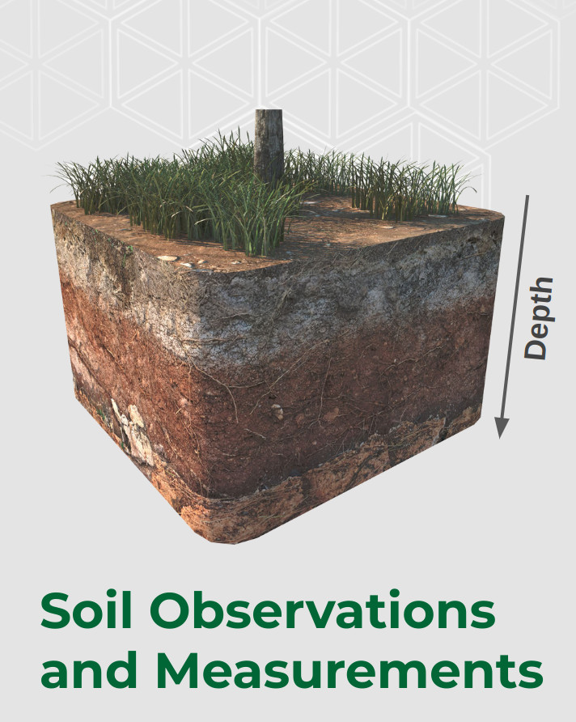
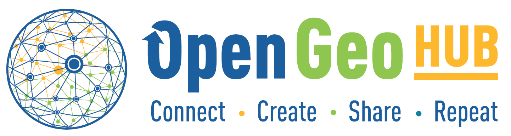

# About {.unnumbered}

## Rationale {.unnumbered}

[{.cover width="250"}](https://opengeohub.github.io/SpatialSamples/) 
This is a public compendium of global, regional, national and
sub-national **soil samples** and/or **soil profile** datasets (points with
Observations and Measurements of soil properties and characteristics).
Datasets listed here, assuming [compatible open data license](https://opendefinition.org/licenses/), are afterwards
imported into the [**Global compilation of soil chemical and physical
properties and soil classes**](https://gitlab.com/openlandmap/) and
eventually used to create a better open soil information across countries.
The specific objectives of this initiative are:

-   To enable data digitization, import and binding + harmonization,\
-   To accelerate research collaboration and networking,\
-   To enable development of more accurate / more usable global and
    regional soil property and class maps (typically published via
    <https://OpenLandMap.org>),

## Download compiled data {.unnumbered}

Compiled data (imported, standardized, quality-controlled) is available 
through a diversity of standard formats:

- CSV file (compressed using giz to reduce download time);
- RDS file (native R data format);
- GPKG file ([Geopackage file](https://www.geopackage.org/) ready to be opened in QGIS);

All files can be downloaded from the `/out` [directory](https://github.com/OpenGeoHub/SoilSamples/-/tree/master/out).

## Add your own data {.unnumbered}

The minimum requirements to submit a dataset for inclusion to [the
OpenLandMap repository](https://gitlab.com/openlandmap/) are:

-   License and terms of use clearly specified AND,\
-   Complete and consistent metadata that can ensure correct
    standardization and harmonization steps AND,\
-   At least 50 unique spatial locations AND,\
-   No broken or invalid URLs,

Datasets that do NOT satisfy the above listed minimum requirements might be
removed. If you discover an issue with license, data description or
version number of a dataset, please open a [Github
issue](https://github.com/OpenGeoHub/SoilSamples/issues).

(\#fig:soil-pnts)Soil profiles and soil samples with chemical and physical properties global compilation. For more info see: https://gitlab.com/openlandmap/compiled-ess-point-data-sets.

Recommended settings for all datasets are:

-   Peer-reviewed versions of the datasets (i.e. a dataset accompanied
    with a peer-reviewed publication) should have the priority,\
-   Register your dataset (use e.g. <https://zenodo.org>) and assign a DOI
    to each version,\
-   Provide enough metadata so that it can be imported and bind with
    other data without errors,\
-   If your dataset is a compilation of previously published datasets, please 
    indicate in the description,

Information outdated or missing? Please open an issue or best do a
correction and then a [pull
request](https://docs.github.com/en/github/collaborating-with-issues-and-pull-requests/creating-a-pull-request).

## Existing soil data projects and initiatives {.unnumbered}

Multiple international organizations from [FAO's Global Soil Partnership](http://www.fao.org/global-soil-partnership/en/) to [UNCCD's Land Degredation Neutrality](https://www.unccd.int/actions/ldn-target-setting-programme), [European Commission](https://esdac.jrc.ec.europa.eu/) and similar, 
support soil data collation projects and especially curation of the legacy soil data. 
Some existing soil Observations and Measurements (O&M) soil data initiatives include:

  - [**FAO's Data Hub**](https://www.fao.org/soils-portal/data-hub/en/),\
  - [**Fine Root Ecology Database (FRED)**](https://roots.ornl.gov/),\
  - [**FLUXNET global network**](https://fluxnet.fluxdata.org/),\
  - [**Global database of soil nematodes**](https://www.nature.com/articles/s41597-020-0437-3),\
  - [**Global soil macrofauna database**](http://macrofauna.earthworms.info/),\
  - [**Global soil respiration database (SRDB)**](https://github.com/bpbond/srdb),\
  - [**International Soil Modeling Consortium (ISMC)**](https://soil-modeling.org),\
  - [**International Soil Moisture Network**](https://ismn.geo.tuwien.ac.at/en/),\
  - [**International Soil Radiocarbon Database (ISRaD)**](https://soilradiocarbon.org),\
  - [**International Soil Carbon Network (ISCN)**](http://iscn.fluxdata.org/),\
  - [**LandPKS project**](http://portal.landpotential.org/#/landpksmap),\
  - [**Long Term Ecological Research (LTER) Network sites**](https://lternet.edu/site/),\
  - [**National Ecological Observatory Network (NEON)**](https://www.neonscience.org),\
  - [**Open Soil Spectral Library (OSSL)**](https://soilspectroscopy.org),\
  - [**Soils Data Harmonization (SoDaH)**](https://lter.github.io/som-website),\
  - [**WoSIS Soil Profile Database**](https://www.isric.org/explore/wosis),

A more in-depth inventory of all various national and international soil datasets can be found in:

- Rossiter, D.G.,: [**Compendium of Soil Geographical Databases**](https://www.isric.org/explore/soil-geographic-databases)\

## Target soil variables {.unnumbered}

Soil variables of interest include:

1.  **Chemical soil properties**:

-   Soil organic carbon, total carbon, total nitrogen,
-   Soil pH, effective Cation Exchange Capacity (eCEC),
-   Soil sodicity (presence of a high proportion of sodium ions relative to other cations),
-   Macro-nutrients: extractable --- potassium (K), calcium (Ca), sodium
    (Na), magnesium (Mg) and similar,
-   Micro-nutrients: phosphorus (P), sulfur (S), iron (Fe), zinc (Zn)
    and similar,
-   Soil pollutants, heavy metals and similar,
-   Electrical conductivity,

2.  **Physical soil properties**:

-   Soil texture and texture fractions: silt, clay and sand, stone content,
-   Bulk density, depth to bedrock and similar,
-   Hydraulic conductivity, water content --- Field Capacity (FC; the amount of water 
    held in the soil after it has been fully wetted and free drainage has stopped), 
    Permanent Wilting Point (PWP; the soil moisture condition at which the plant could 
    not obtain water and would wilt and die), Plant Available Water Capacity (PAWC; 
    the amount of water between field capacity and permanent wilting point water holding capacity) and
    similar,
-   Soil temperature,

3.  **Soil biological / biodiversity variables**:

-   Soil biomass,
-   Soil micro-, meso-, macro- and mega-fauna abundance,
-   Soil biodiversity indices,

4.  **Soil classification / taxonomy variables**:

-   Soil type,
-   Soi suitability classes, soil fertility classes,
-   Soil texture classes and families,

5.  **Soil absorbances / soil spectroscopy variables**:

-   Soil absorbance in VIS-NIR and MIR part of spectra,

## Recommended O&M standards {.unnumbered}

As a general rule of thumb we recommend all contributors to use the following 
[general scheme](https://soilspectroscopy.github.io/ossl-manual/) to organize Soil Observations & Measurements with 3–4 main tables 
and metadata + legends organized in other tables:

- Soil site information (geographical coordinates, land use / land cover, soil classification etc),
- Soil horizon information (soil observations and measurements specific to soil layers / diagnostic horizons),
- Proximal soil sensing information including soil scans,

For making soil observations and measurements we recommend following the USDA [National Cooperative Soil Survey (NCSS) Soil 
Characterization Database](https://ncsslabdatamart.sc.egov.usda.gov/) codes and specification as much as possible. These are explained in detail in the [**Kellogg Soil Survey Laboratory Methods Manual**](https://www.nrcs.usda.gov/Internet/FSE_DOCUMENTS/stelprdb1253872.pdf) 
and [**The Field Book for Describing and Sampling Soils**](https://www.nrcs.usda.gov/wps/portal/nrcs/detail/soils/research/guide/). 
Likewise, [**FAO Guidelines for soil description**](http://www.fao.org/3/a0541e/a0541e.pdf), 
and the FAO's [GSOC measurement, monitoring, reporting and verification (MRV) protocol](http://www.fao.org/documents/card/en/c/cb0509en/) also explain in 
detail how to collect soil samples and setup a system for monitoring soil organic carbon.

It is recommended that one should, as much as possible, use the international standards 
and references. Some highly recommended protocols and standards include:

- [UUID generator tool](https://cran.r-project.org/package=uuid) to generate unique ID's for unique soil sites, horizons, samples etc (to convert an existing local ID to UUID, best use `openssl::md5(local_id)`),
- [Open Location Codes](https://opensource.google/projects/open-location-code) to generate geographic location codes,
- [OGC standards](https://www.ogc.org/standards/om) to prepare metadata and exchange data across field / computer systems;
- [ISO8601](https://en.wikipedia.org/wiki/ISO_8601) to save time and date information,
- [ISO3166](https://en.wikipedia.org/wiki/ISO_3166-1) for country / administrative codes,
- [GPS](https://www.gps.gov/) and WGS84 longitude and latitude in decimal degrees to save the location information,
- [International DOI foundation](https://en.wikipedia.org/wiki/Digital_object_identifier) to refer to specific dataset and/or publication,
- [USDA soil classification system](https://www.nrcs.usda.gov/wps/portal/nrcs/main/soils/survey/class/) and [World Reference Base](http://www.fao.org/soils-portal/data-hub/soil-classification/world-reference-base/en/) to classify soils,
- [USDA soil texture calculator](https://www.nrcs.usda.gov/wps/portal/nrcs/detail/soils/survey/?cid=nrcs142p2_054167) to determine and share soil texture classes including texture-by-hand, 
- [Kellogg Soil Survey Laboratory Methods Manual](https://www.nrcs.usda.gov/Internet/FSE_DOCUMENTS/stelprdb1253872.pdf) for reference physical and chemical soil property determination in laboratory,
- [Soils Laboratory Manual, K-State Edition](https://kstatelibraries.pressbooks.pub/soilslabmanual/),
- [GLOSOLAN Standard Operating Procedures (SOPs)](http://www.fao.org/global-soil-partnership/glosolan/soil-analysis/standard-operating-procedures/en/#c763834),

## Contributing {.unnumbered}

Please feel free to contribute entries. See [GitHub
repository](https://github.com/OpenGeoHub/SoilSamples) for more detailed
instructions.

## Contributors {.unnumbered}

If you contribute, add also your name and Twitter, ORCID or blog link
below:

[Tomislav Hengl](https://twitter.com/tom_hengl), [Jonathan Sanderman](https://twitter.com/sandersoil), [Mario Antonio Guevara
Santamaria](https://orcid.org/0000-0002-9788-9947),

This document is based on the <https://www.bigbookofr.com/> repository
by Oscar Baruffa.

## Disclaimer {.unnumbered}

The data is provided "as is". [OpenGeoHub foundation](https://opengeohub.org/about) and its suppliers and licensors hereby disclaim all warranties of any kind, express or implied, including, without limitation, the warranties of merchantability, fitness for a particular purpose and non-infringement. Neither OpenGeoHub foundation nor its suppliers and licensors, makes any warranty that the Website will be error free or that access thereto will be continuous or uninterrupted. You understand that you download from, or otherwise obtain content or services through, the Website at your own discretion and risk.

## Licence {.unnumbered}

This website/book is free to use, and is licensed under the [Creative Commons Attribution-ShareAlike 4.0 International License](http://creativecommons.org/licenses/by-sa/4.0/).

## Literature {.unnumbered}

Some other connected publications and initiatives describing collation 
and import of legacy soil observations and measurements that might interest
you:

-   Arrouays, D., Leenaars, J. G., Richer-de-Forges, A. C., Adhikari,
    K., Ballabio, C., Greve, M., ... & Heuvelink, G. (2017). [**Soil
    legacy data rescue via GlobalSoilMap and other international and
    national initiatives**](https://doi.org/10.1016/j.grj.2017.06.001).
    GeoResJ, 14, 1-19.\
-   Beillouin, D., Cardinael, R., Berre, D., Boyer, A., Corbeels, M., 
    Fallot, A., ... & Demenois, J. (2021). A global overview of studies 
    about land management, land‐use change, and climate change effects 
    on soil organic carbon. Global Change Biology. <https://doi.org/10.1111/gcb.15998>\ 
-   Batjes, N. H., Ribeiro, E., van Oostrum, A., Leenaars, J., Hengl,
    T., & de Jesus, J. M. (2017). [**WoSIS: providing standardised soil
    profile data for the world**](http://www.earth-syst-sci-data.net/9/1/2017/). Earth System Science Data, 9(1), 1. <https://doi.org/10.5194/essd-9-1-2017>\ 
-   Billings, S. A., Lajtha, K., Malhotra, A., Berhe, A. A., de Graaff, M. A., 
    Earl, S., ... & Wieder, W. (2021). [**Soil organic carbon is not just for soil 
    scientists: measurement recommendations for diverse practitioners**](https://doi.org/10.1002/eap.2290). Ecological     Applications, 31(3), e02290. <https://doi.org/10.1002/eap.2290>\
-   Brown, G., Demeterio, W. and Samuel-Rosa, A. (2021). [**Towards a more open Soil Science**](https://blog.scielo.org/en/2021/01/08/towards-a-more-open-soil-science/). SciELO in Perspective, 2021 [viewed 17 June 2021].
-   Gupta, S., Hengl, T., Lehmann, P., Bonetti, S., & Or, D. (2021). [**SoilKsatDB: 
    global database of soil saturated hydraulic conductivity measurements for 
    geoscience applications**](https://doi.org/10.5194/essd-13-1593-2021). Earth System Science Data, 13(4), 1593-1612. 
    <https://doi.org/10.5194/essd-13-1593-2021>\
-   Hengl, T., MacMillan, R.A., (2019). [**Predictive Soil Mapping with
    R**](https://soilmapper.org/). OpenGeoHub foundation, Wageningen, the
    Netherlands, 370 pages, <https://soilmapper.org>, ISBN:
    978-0-359-30635-0.\
-   Moorberg, C. J., & Crouse, D. A. (2017). [**An open‐source laboratory manual for introductory, undergraduate soil science courses**](https://doi.org/10.4195/nse2017.06.0013). Natural Sciences Education, 46(1), 1-8.\
-   Ramcharan, A., Hengl, T., Beaudette, D., & Wills, S. (2017). [**A soil
    bulk density pedotransfer function based on machine learning: A case
    study with the NCSS soil characterization
    database**](https://doi.org/10.2136/sssaj2016.12.0421). Soil Science
    Society of America Journal, 81(6), 1279-1287.
    <https://doi.org/10.2136/sssaj2016.12.0421>
-   Rossiter, D.G.,: [**Compendium of Soil Geographical
    Databases**](https://www.isric.org/explore/soil-geographic-databases).

## About OpenGeoHub {.unnumbered}

**OpenGeoHub foundation** is a not-for-profit research foundation
located in Wageningen, the Netherlands. We specifically promote
publishing and sharing of Open Geographical and Geoscientific Data,
using and developing Open Source Software and encouraging and empowering
under-represented researchers e.g. those from ODA recipient countries
and female researchers. We believe that the key measure of quality of
research in all sciences (and especially in geographical information
sciences) is in transparency and reproducibility of the computer code
used to generate results (read more in: ["Everyone has a right to know
what is happening with the planet"](https://opengeohub.medium.com/)).

## Acknowledgments {.unnumbered}

[**SoilSpec4GG**](https://soilspectroscopy.org/) is a USDA-funded [Food and Agriculture Cyberinformatics
Tools Coordinated Innovation Network NIFA Award #2020-67021-32467](https://nifa.usda.gov/press-release/nifa-invests-over-7-million-big-data-artificial-intelligence-and-other) project. It brings together soil
scientists, spectroscopists, informaticians, data scientists and
software engineers to overcome some of the current bottlenecks
preventing wider and more efficient use of soil spectroscopy. For more info refer
to: <https://soilspectroscopy.org/>

**[EcoDataCube.eu](https://EcoDataCube.eu/)** project is co-financed by the European Union (**[CEF Telecom project 2018-EU-IA-0095](https://ec.europa.eu/inea/en/connecting-europe-facility/cef-telecom/2018-eu-ia-0095)**).

**[EarthMonitor.org](https://EarthMonitor.org/)** project has received funding from the European Union's Horizon Europe research an innovation programme under grant agreement **[No. 101059548](https://cordis.europa.eu/project/id/101059548)**.
