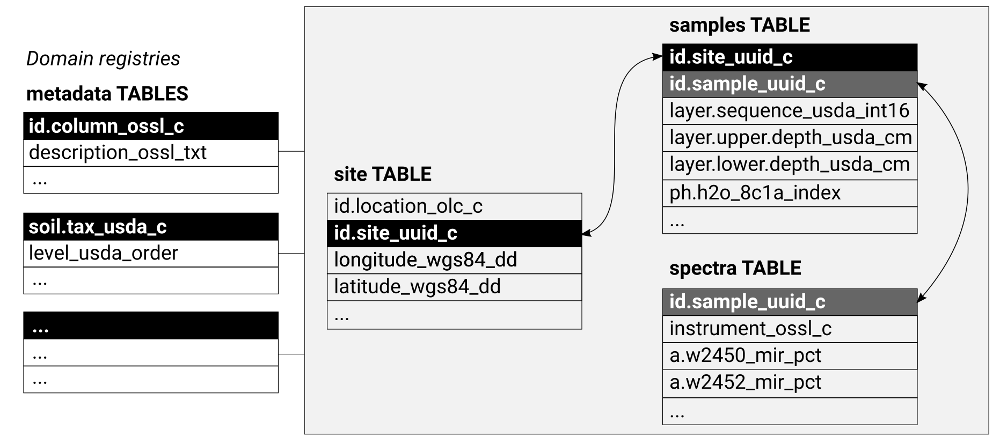

# About

## Rationale

This is a public compendium of global, regional, national and
sub-national **soil samples** and/or **soil profile** datasets (points with
Observations and Measurements of soil properties and characteristics).
Datasets listed here, assuming compatible open license, are afterwards
imported into the [**Global compilation of soil chemical and physical
properties and soil classes**](https://gitlab.com/openlandmap/) and
eventually used to create better open soil information across countries.
The specific objectives of this initiative are:

-   To enable data digitization, import and binding + harmonization,\
-   To accelerate research collaboration and networking,\
-   To enable development of more accurate / more usable global and
    regional soil property and class maps (typically published via
    <https://OpenLandMap.org>),

The minimum requirements to submit a dataset for inclusion to [the
OpenLandMap repository](https://gitlab.com/openlandmap/) are:

-   License and terms of used specified AND,\
-   Complete and consistent metadata that ensures correct
    standardization and harmonization steps AND,\
-   At least 50 unique spatial locations AND,\
-   No broken our invalid URLs,

Datasets that do not satisfy the above listed requirements might be
removed. If you discover an issue with license, data description or
version number, please open a [Github
issue](https://github.com/OpenGeoHub/SoilSamples/issues).

Recommended settings for all datasets are:

-   Peer-reviewed versions of the datasets (i.e. a dataset accompanied
    with a publication) should have the priority,\
-   Register your dataset (use e.g. <https://zenodo.org>) and assign a DOI
    to each version,\
-   Provide enough metadata so that it can be imported and bind with
    other data without errors,

Information outdated or missing? Please open an issue or best do a
correction and then a [pull
request](https://docs.github.com/en/github/collaborating-with-issues-and-pull-requests/creating-a-pull-request).

```{r soil_pnts, echo=FALSE, fig.cap="Soil profiles and soil samples with chemical and physical properties global compilation.", out.width="100%"}
knitr::include_graphics("https://gitlab.com/openlandmap/compiled-ess-point-data-sets/-/raw/master/img/sol_chem.pnts_sites.png")
```

Soil variables of interest include:

1.  **Chemical soil properties**:

-   Soil organic carbon, total carbon, total nitrogen,
-   Soil pH, effective Cation Exchange Capacity (eCEC),
-   Macro-nutrients: extractable --- potassium (K), calcium (Ca), sodium
    (Na), magnesium (Mg) and similar,
-   Micro-nutrients: phosphorus (P), sulfur (S), iron (Fe), zinc (Zn)
    and similar,
-   Soil pollutants, heavy metals and similar,
-   Electrical conductivity,

2.  **Physical soil properties**:

-   Texture fractions: silt, clay and sand, stone content,
-   Bulk density, depth to bedrock and similar,
-   Hydraulic conductivity, water content, water holding capacity and
    similar,
-   Soil temperature,

3.  **Soil biological / biodiversity variables**:

-   Soil biomass,
-   Soil micro-, meso-, macro- and mega-fauna abundance,
-   Soil biodiversity indices,

4.  **Soil classification / taxonomy variables**:

-   Soil type,
-   Soi suitability classes,
-   Soil texture classes and families,

5.  **Soil absorbances / soil spectroscopy variables**:

-   Soil absorbance in VIS-NIR and MIR part of spectra,

This document is based on the <https://www.bigbookofr.com/> repository
by Oscar Baruffa.

## Recommended columns

As a general rule of thumb we recommend all contributors to use the following 
general scheme to organize Soil Observations & Measurements:

```{r soil_db, echo=FALSE, fig.cap="Recommended soil profiles and soil samples database schema.", out.width="100%"}

```

For the `site` table please add (at least) the following columns:

1. Unique site ID generated using some UUID generator tool; example: `id.ossl_uuid_c = '672d1fd6-b186-11eb-8a61-7446a0925130'`\
2. Unique [Open Location Codes](https://opensource.google/projects/open-location-code) ID which identifies the site location; example: `id.location_olc_c = '84MVX5FH+PJ'`\
3. [Observation OGC](https://www.ogc.org/standards/om) schema title; example: `observation.ogc.schema.title_ogc_txt = 'Open Soil Spectroscopy Library'`\
4. [Observation OGC](https://www.ogc.org/standards/om) schema URL; example: `observation.ogc.schema_idn_url = ''`\
5. Observation date begin; example: `observation.date.begin_iso.8601_yyyy.mm.dd = '2000.02.10'`\
6. Observation date end; example: `observation.date.end_ iso.8601_yyyy.mm.dd = '2000.02.10'`\
7. Location address as Street and number, Local postcode, Town, County, State; example: `location.address_utf8_txt = ''`\
8. Country(ies) the data was/were collected; example: `location.country_iso.3166_c = 'USA'`\
9. Location method e.g. GPS; example: `location.method_any_c = 'GPS'`\
10. Field surveyor title or organization; example: `surveyor.title_utf8_txt = 'USDA Natural Resource Conservation Service (NRCS) staff'`\
11. Field surveyor contact email; example: `surveyor.contact_ietf_email = ''`\
12. Field surveyor address as Street and number, Local postcode, Town, County, State; example: `surveyor.address_utf8_txt = 'USDA-NRCS-NSSC, Federal Building, Room 152, Mail Stop, 100 Centennial Mall North, Lincoln, NE'`\
13. Site [WGS84 longitude](https://spatialreference.org/ref/epsg/wgs-84/) coordinate; example: `longitude_wgs84_dd = '-122.8208847'`\
14. Site [WGS84 latitude](https://spatialreference.org/ref/epsg/wgs-84/) coordinate; example: `latitude_wgs84_dd = '43.9742584'`\
15. Approximate location error (for GPS coordinates use 30 m); example: `location.error_any_m = '30'`
Title of the dataset; example: `dataset.title_utf8_txt = 'Kellog's lab SSL'`\
16. Code identification of the dataset; example: `dataset.code_ascii_txt = 'KSSL'`\
17. The URL address of the dataset web page; example: `dataset.address_idn_url = 'https://ncsslabdatamart.sc.egov.usda.gov/'`\
18. Data license title for the dataset; example: `dataset.license.title_ascii_txt = 'CC-0'`\
19. Data license URL for the dataset; example: `dataset.license.address_idn_url = 'https://creativecommons.org/share-your-work/public-domain/cc0/'`\
20. International DOI foundation code for the corresponding dataset version; example: `dataset.doi_idf_c = '10.2136/sssaj2019.06.0205'`\
21. Person responsible for the dataset; example: `dataset.contact.name_utf8_txt = 'Richard R. Ferguson'`
Email contact of the person responsible for the dataset; example: `dataset.contact.email_ietf_email = 'support@usda.gov'`\
22. Local dataset ID of the site; example: `id.dataset.site_ascii_c = '603'`\
23. Local user assigned ID of the site; example: `id.user.site_ascii_c = '01-DRJ-01'`\
24. Layer sequence number; example: `layer.sequence_usda_uint16 = '11'`\
25. Layer type; example: `layer.type_usda_c = 'horizon'`\
26. Unique project code; example: `id.project_ascii_c = '33'`\

For the `samples` table please use any of the columns:

1. Unique site ID generated using some UUID generator tool; example: `id.ossl_uuid_c = '672d1fd6-b186-11eb-8a61-7446a0925130'`\
2. Unique sample ID generated using some UUID generator tool.
3. Layer field label used e.g. for soil samples; example: `layer.field.label_any_c = 'S00OR-039-001-2'`\
4. Layer upper depth in cm; example: `layer.upper.depth_usda_cm = '13'`\
5. Layer lower depth in cm; example: `layer.lower.depth_usda_cm = '36'`\
6. Layer horizon designation based on USDA system; example: `horizon.designation_usda_c = 'A2'`\
7. Layer horizon designation disconituity based on USDA system; example: `horizon.designation.discontinuity_usda_c = ''`\
8. Layer horizon structure type based on USDA system; example: `layer.structure.type_usda_c = ''`\
9. Layers horizon structure grade based on the USDA system; example: `layer.structure.grade_usda_c = ''`\
10. Layer texture class based on the USDA system; example: `layer.texture_usda_c = 'Gravelly Clay'`\

For the `spectra` table please use the following columns:


## Contributing

Please feel free to contribute entries. See [GitHub
repository](https://github.com/OpenGeoHub/SoilSamples) for more detailed
instructions.

## Contributors

If you've contribute, add also your name and Twitter, ORCID or blog link
below:

[Tomislav Hengl](https://twitter.com/tom_hengl), [Jonathan Sanderman](https://twitter.com/sandersoil), [Mario Antonio Guevara
Santamaria](https://orcid.org/0000-0002-9788-9947),

## Disclaimer

The data is provided "as is". [OpenGeoHub foundation](https://opengeohub.org/about) and its suppliers and licensors hereby disclaim all warranties of any kind, express or implied, including, without limitation, the warranties of merchantability, fitness for a particular purpose and non-infringement. Neither OpenGeoHub foundation nor its suppliers and licensors, makes any warranty that the Website will be error free or that access thereto will be continuous or uninterrupted. You understand that you download from, or otherwise obtain content or services through, the Website at your own discretion and risk.

## Licence

This website/book is free to use, and is licensed under the [Creative
Commons Attribution 3.0
License](https://creativecommons.org/licenses/by/3.0/).

## Soil Spectroscopy for Global Good

**SoilSpec4GG** is a USDA-funded Food and Agriculture Cyberinformatics
Tools Coordinated Innovation Network project. It brings together soil
scientists, spectroscopists, informaticians, data scientists and
software engineers to overcome some of the current bottlenecks
preventing wider and more efficient use of soil spectroscopy. A series
of working groups will be formed to address topics including calibration
transfer, model choice, outreach & demonstration, and use of
spectroscopy to inform global carbon cycle modeling. For more info refer
to: <https://soilspectroscopy.org/>

## About OpenGeoHub

**OpenGeoHub foundation** is a non-for-profit research foundation
located in Wageningen, the Netherlands. We specifically promote
publishing and sharing of Open Geographical and Geoscientific Data,
using and developing Open Source Software and encouraging and empowering
under-represented researchers e.g. those from ODA recipient countries
and female researchers. We believe that the key measure of quality of
research in all sciences (and especially in geographical information
sciences) is in transparency and reproducibility of the computer code
used to generate results (read more in: ["Everyone has a right to know
what is happening with the planet"](https://opengeohub.medium.com/)).

Some other connected publications and initiatives describing collation 
and import of legacy soil observations and measurements that might interest
you:

-   Arrouays, D., Leenaars, J. G., Richer-de-Forges, A. C., Adhikari,
    K., Ballabio, C., Greve, M., ... & Heuvelink, G. (2017). [**Soil
    legacy data rescue via GlobalSoilMap and other international and
    national initiatives**](https://doi.org/10.1016/j.grj.2017.06.001).
    GeoResJ, 14, 1-19.\
-   Batjes, N. H., Ribeiro, E., van Oostrum, A., Leenaars, J., Hengl,
    T., & de Jesus, J. M. (2017). [**WoSIS: providing standardised soil
    profile data for the world**](http://www.earth-syst-sci-data.net/9/1/2017/). Earth System Science Data, 9(1), 1. <https://doi.org/10.5194/essd-9-1-2017>\ 
-   Gupta, S., Hengl, T., Lehmann, P., Bonetti, S., & Or, D. (2021). [**SoilKsatDB: 
    global database of soil saturated hydraulic conductivity measurements for 
    geoscience applications**](https://doi.org/10.5194/essd-13-1593-2021). Earth System Science Data, 13(4), 1593-1612. 
    <https://doi.org/10.5194/essd-13-1593-2021>\
-   Hengl, T., MacMillan, R.A., (2019). [**Predictive Soil Mapping with
    R**](https://soilmapper.org/). OpenGeoHub foundation, Wageningen, the
    Netherlands, 370 pages, <https://soilmapper.org>, ISBN:
    978-0-359-30635-0.\
-   Ramcharan, A., Hengl, T., Beaudette, D., & Wills, S. (2017). [**A soil
    bulk density pedotransfer function based on machine learning: A case
    study with the NCSS soil characterization
    database**](https://doi.org/10.2136/sssaj2016.12.0421). Soil Science
    Society of America Journal, 81(6), 1279-1287.
    <https://doi.org/10.2136/sssaj2016.12.0421>
-   Rossiter, D.G.,: [**Compendium of Soil Geographical
    Databases**](https://www.isric.org/explore/soil-geographic-databases).
